# VBCS Deployment

### Prerequisites 

This section assumes the following resources are configured: 
* [IDCS Application](./business_idcs.md)
* [Engine Application](./nl2sql_engine.md)
* [API Gateway](./business_api_gateway.md)
* [ODA](./oda.md)

### Setup Identity Group

#### Create Group

1.  Sign in to your Oracle Cloud account as an administrator.
2.  In Oracle Cloud Infrastructure Console, navigate to **Identity &
    Security**, and click **Domains**.
3.  Select \<Domain\>
4.  Click the name of the identity domain, and click **User management**.

5.  Create the following groups \[Do not change the names, as they are being referred with the same name within VBCS application\]

6.  Click Create group

 

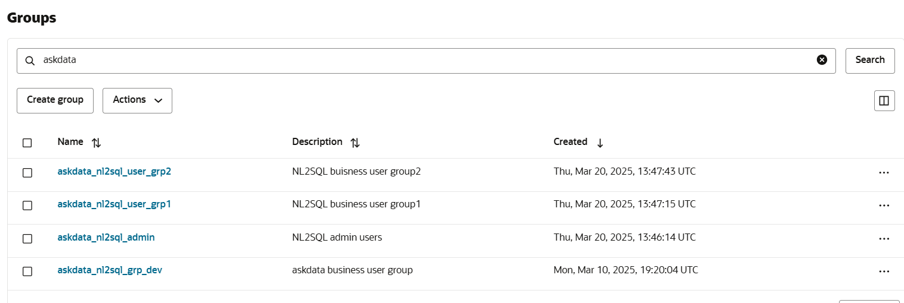

 

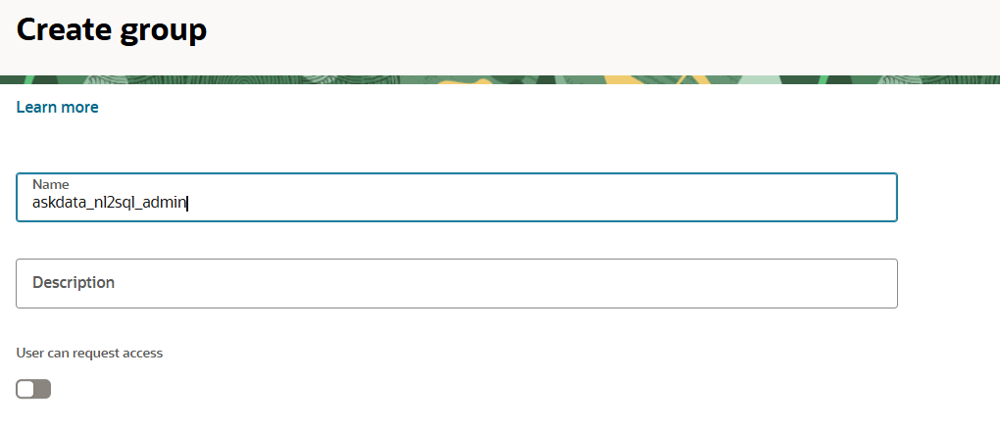

## VBCS

### VBCS Setup – Provision VBCS Instance

#### Provision VBCS Instance

1. Open the OCI Console.

2. In the upper-left corner, click **Navigation Menu**

3. Select **Developer Services** and then select **Visual Builder**.

 

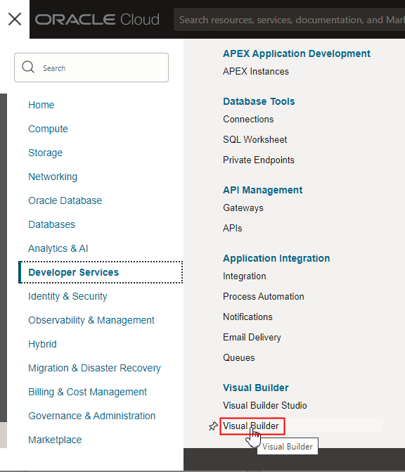

4. On the Visual Builder Instances page, from the **Compartment** drop-down list, select \<compartment you created\> to host the Visual Builder instance.

5. Click **Create Instance**.

 

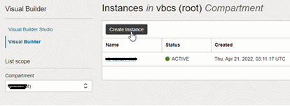

6. In **Name**, enter the Visual Builder instance's name.

Example: nl2sql_dev_vbcs

7. (Optional) In **Compartment**, select the compartment you created to host the Visual Builder instance. If you've selected the compartment in Step 4, ignore this step.

Example: genai-demos

8. Click **Create Visual Builder Instance**.

### VBCS Setup – User Access to VBCS Instance

#### Grant user access

1. Sign in to Oracle Cloud.

2. From the Infrastructure Console, click the navigation menu   in the top left corner, expand **Identity**, and then click **Domains**.

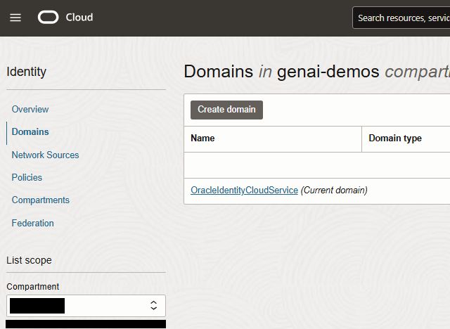

3. Click the **Oracle Identity Cloud Service** link.

4. From the Oracle Identity Cloud Service page, click **Oracle Cloud Services**.

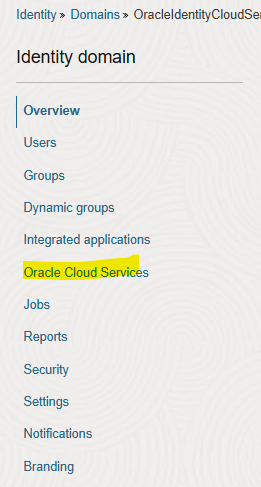

5.  Search and open IDCS app corresponding to the your VBCS instance

Search keyword example: nl2sql

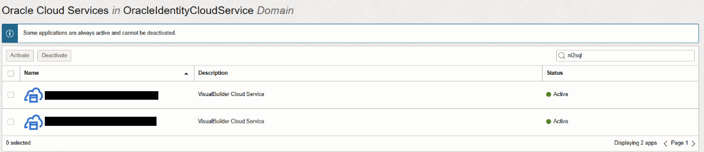

6. Navigate to Application roles

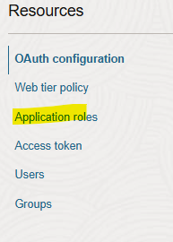

7. Select applicable role(s) such as Service Administrator, add users by clicking on Manage link

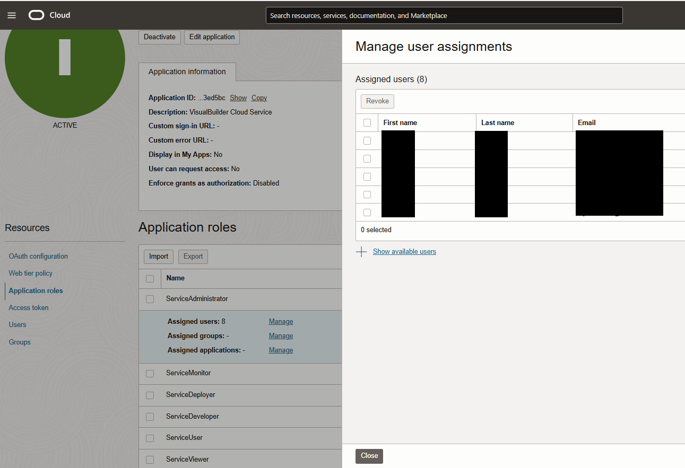

### Deploy VBCS Applications

#### Deploy Applications

1. Applications:-

| Application | Example |
|----------------|-------------| 
| Main Application/Landing page | \<vbcs-askdata\> |
| Feedback application | \<vbcs-FeedbackSPA\> |
| Interactive Graph application | \<vbcs-InteractiveGraph\> |
| Table Graph UI | \<vbcs-Table_Graph_UI\> |

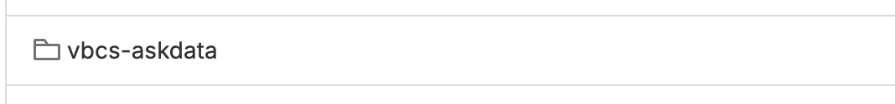

**(you may need to zip the above folder for the main app before importing)**

- **Update** The VBCS application files are found in [vbcs_oda_archives](../../../vbcs_oda_archives/).
    - Navigate to vbcs_oda_archives and zip the respective applications
        - zip -r my-vb-app.zip ./<my-vb-app>
    - Import the zip to VBCS

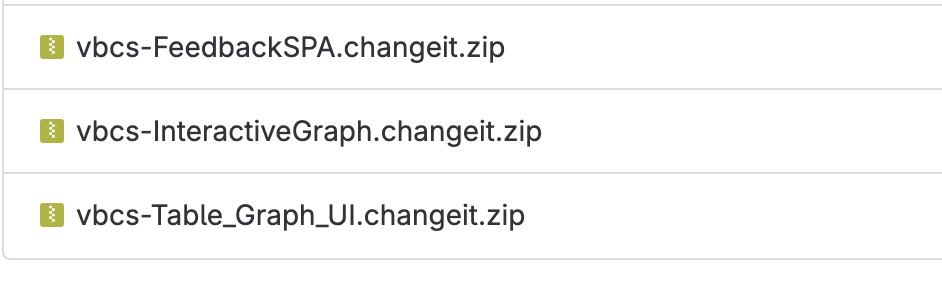

2.  Navigate to your Visual Applications Home page and click **Import**.

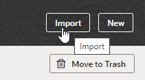

3. Click **Application from file** in the Import dialog box.

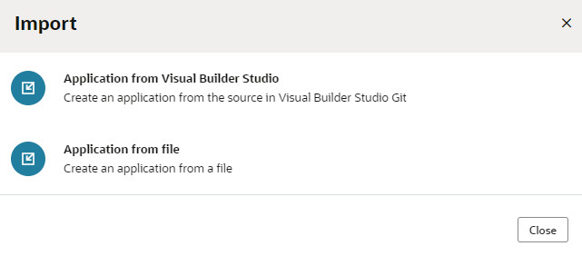

4. Drag the visual application archive file on your local system into the dialog box. Alternatively, click the upload area in the dialog box and use the file browser to locate the archive on your local system.

5. Enter the Application Display Name and Application ID. Both fields are automatically populated based on the archive name, but you may want to modify the name as desired and the ID to be unique in your identity domain.

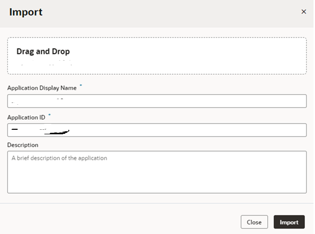

6. Click **Import**.

### Update VBCS Applications

#### ODA URL, Channel ID, WebSocket, IDCS, Backend URL

1. After Importing**, Open main app** (vbcs_askdata)

Go to “main-start” 🡪 JavaScript (tab)

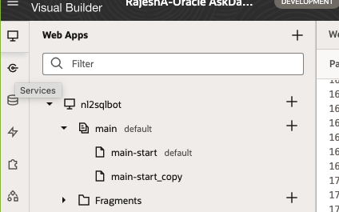

2. Update ODA URL & Channel below

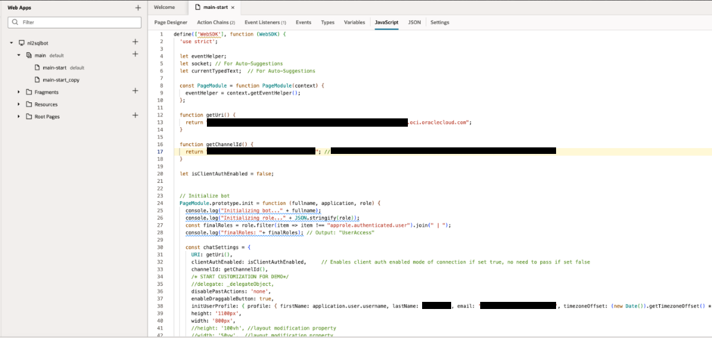

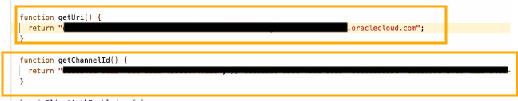

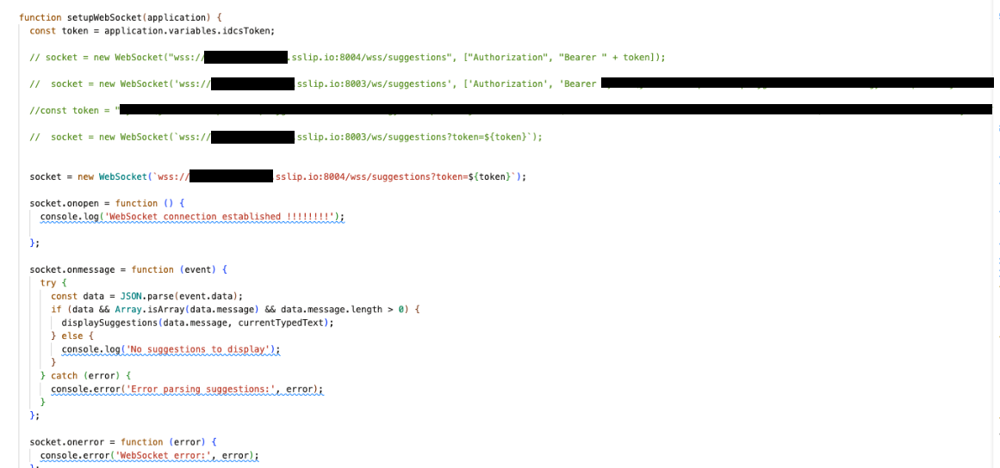

3. Next Go to server connections

#### Overview

 Click on link “IDCSBackend” under overview.

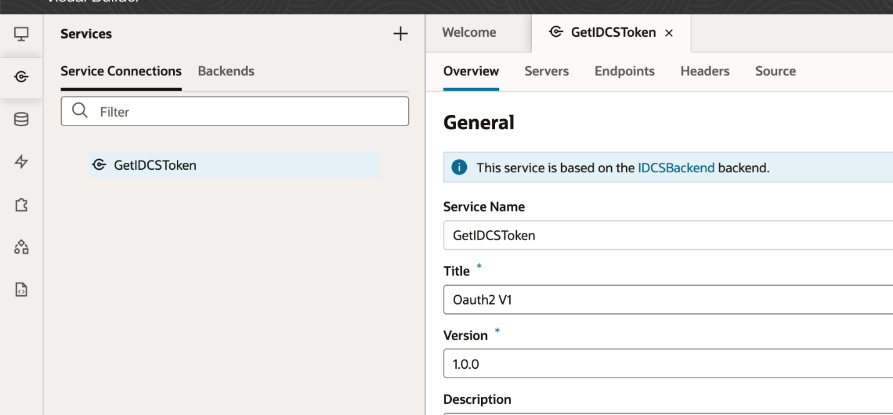

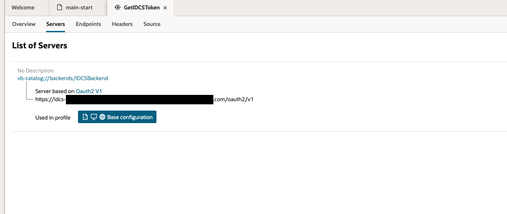

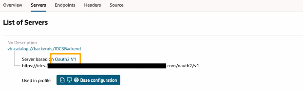

Click on the pencil icon.

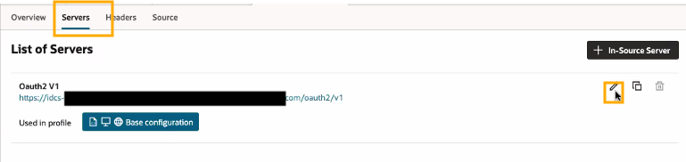

> Under Authentication:
> Update Username and Password (these are from confidential IDCS app – client id & secret).

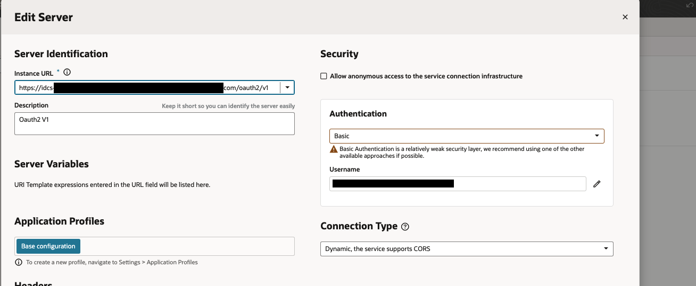

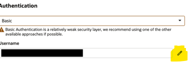

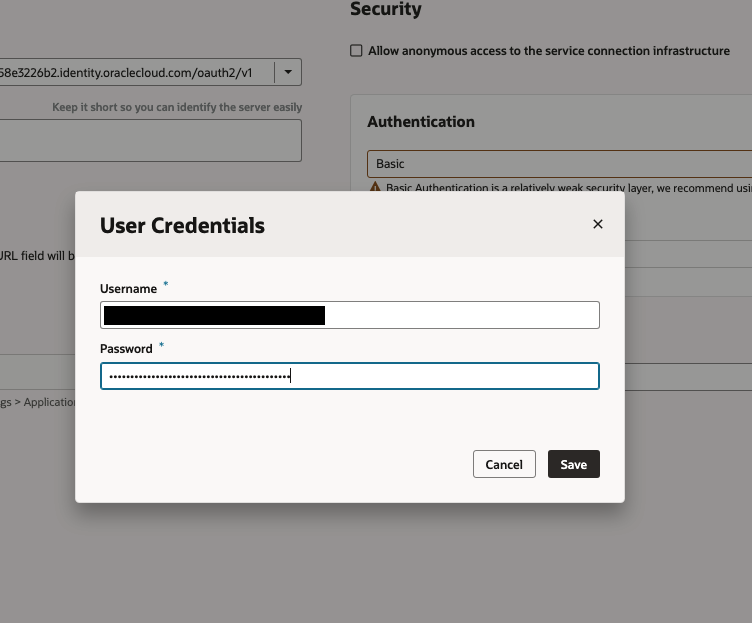

> Also verify the Instance URL.

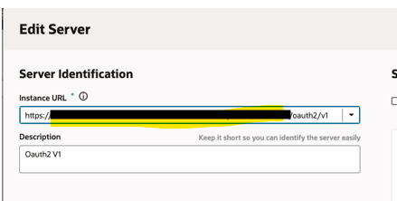

4.  Similarly**,** Open Interactive Graph app & Table-Graph app

Go to Services 🡪 Service Connections 🡪 interactive-graph (for Interactive Graph App)

Go to Services 🡪 Service Connections 🡪 interactiveTables (for Table_Graph App)

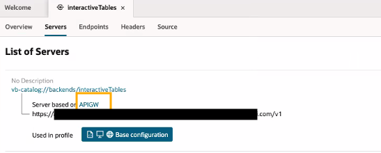

Click on the pencil icon

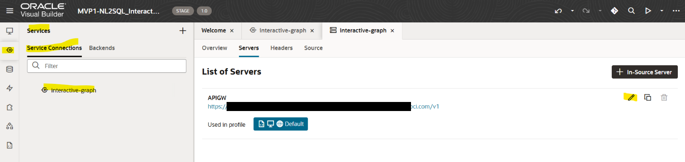

Verify/Edit the Instance URL. This points to APIGW. Therefore, this should match the APIGW url. 
\[Example, <https://apigw-url.apigateway.us-chicago-1.oci.customer-oci.com/v1>\]

Verify/Edit Authentication section. This should match the [IDCS confidential app](./business_idcs.md) that was setup earlier.

- Authentication: OAuth 2.0 Client Credentials
- Client ID & Secret: \<click pencil icon to enter client id and secret\>
- Scope: \<Example: urn:opc:idm:\_\_myscopes\_\_\> (if using same instructions from IDCS App, odatest)
- Token URL: \<Example:
<https://idcs-server.identity.oraclecloud.com/oauth2/v1/token>\>

- Connection Type: \<Example: Dynamic, the service does not support CORS\>

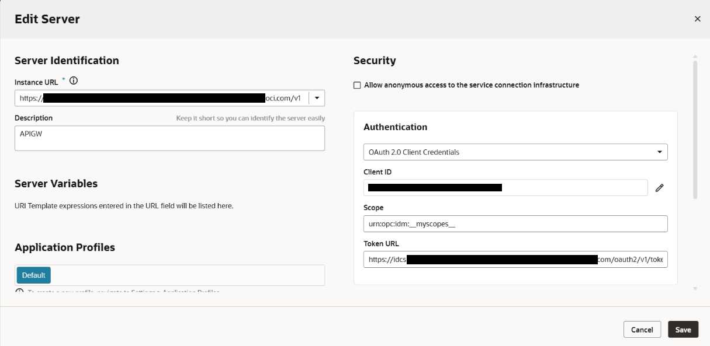

### Stage VBCS Applications

#### Stage

Stage VBCS Applications.

**<u>Please note that the display names of the deployed VBCS applications might differ from those shown in the screenshot below.</u>**

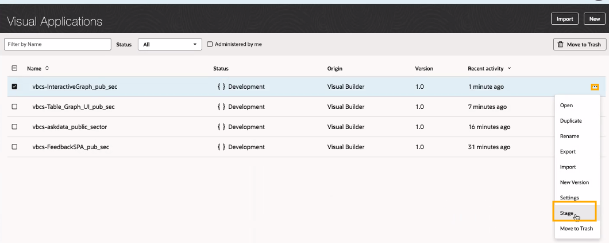

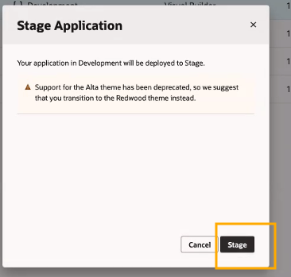

If you are prompted with the following question, select “Stage application with a clean database”

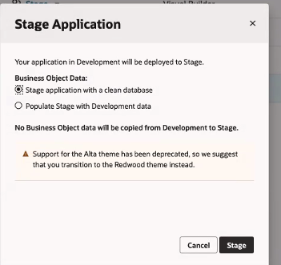

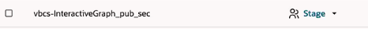

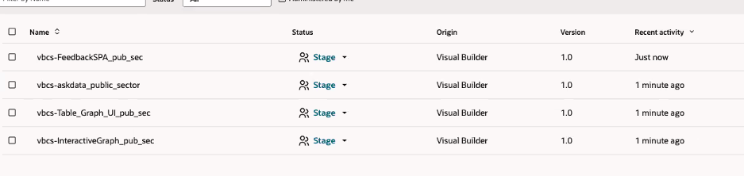

Make a note of URLs, especially Table_Graph app and InteractiveGraph app as you will need to specify the URLs in the properties file on the VM server.

### Edit VBCS Application URLs in VM1

#### Edit Table Graph and Interactive Graph URL in VM1

> SSH into VM1
>
> Edit file: /home/opc/ConfigFile.properties
>
> Goto the following section and edit,
>
> \[vbcs\]  
> endpoint.url=  
> graph_app.url=\<graph_app url\>/  
> idata_app.url=\<table_graph_app_url\>/
>
> Example:
>
> \[vbcs\]  
> endpoint.url=<https://your-vb-instance.builder.us-chicago-1.ocp.oraclecloud.com/ic/builder/rt/>  
> graph_app.url=vbcs_InteractiveGraph_pub_sec/1.0/webApps/nl2sql_interactivegraph/  
> idata_app.url=vbcs_Table_Graph_UI_pub_sec/1.0/webApps/dynamictabledata/
>
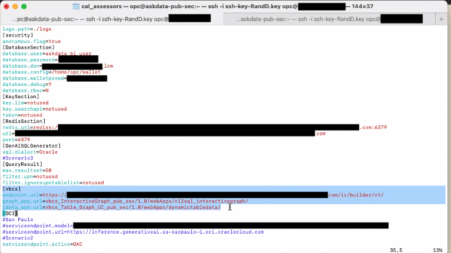

### Test Application

Once engine config is updated to include the above vb applications, and everything is configured correctly, you should be able to converse with AskData: 

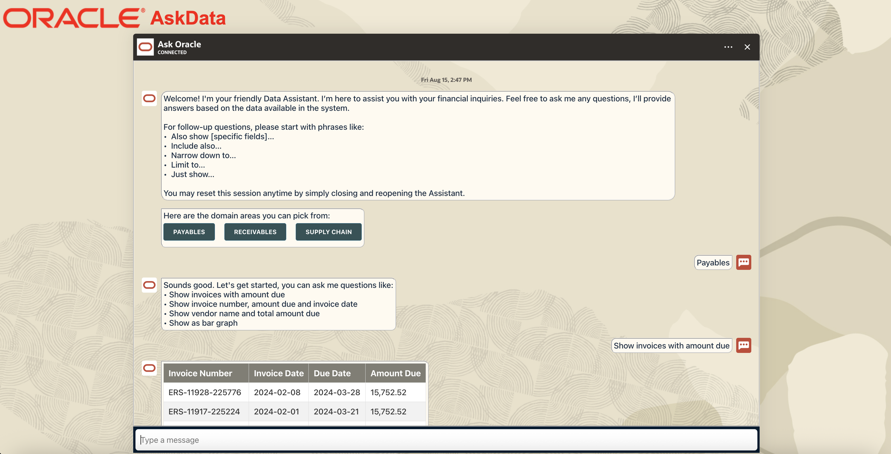

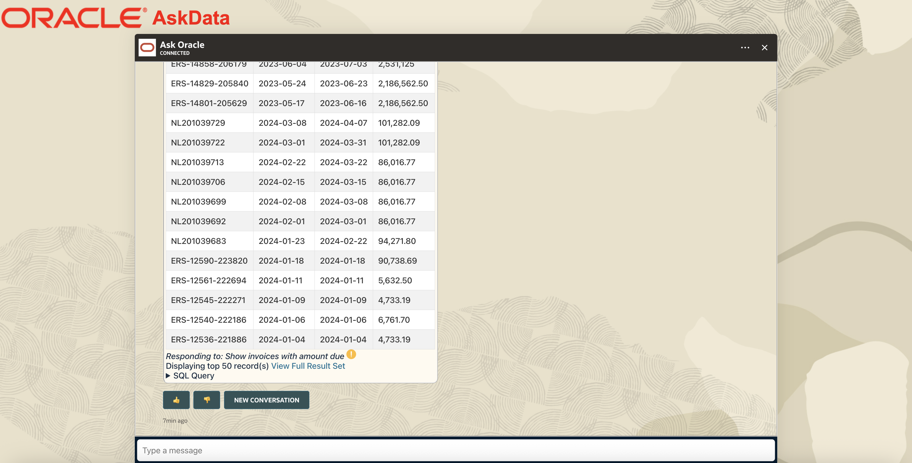

> **Note** You can select "View Full Result Set" to open another visual interface 

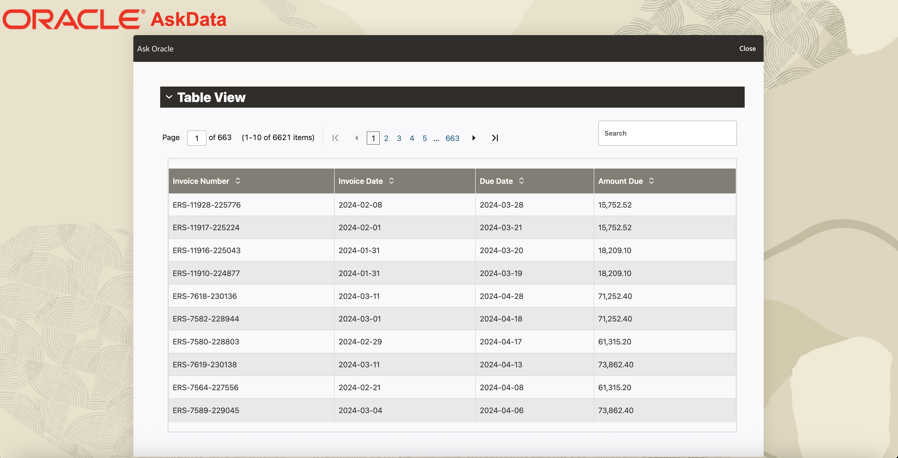

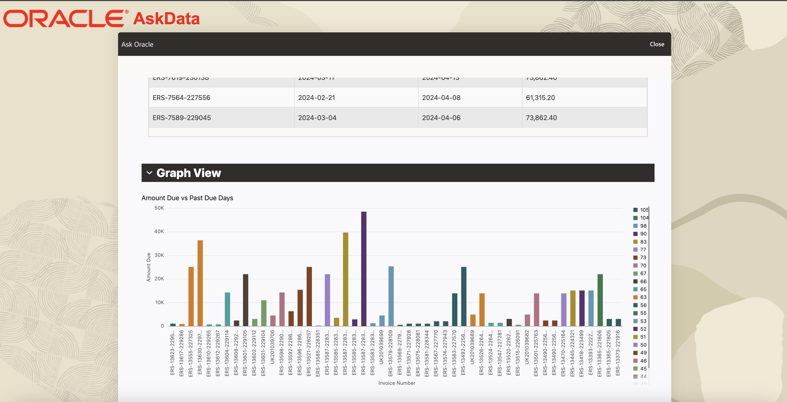
## Private Resources

This section is applicable only if the target APIs accessed by ODA and
VBCS are in a private subnet. For example, if the APIs are fronted by a
private API Gateway. Otherwise, skip this section.

### Create ODA Private Endpoint using OCI Console

#### ODA Private Endpoint

By default, ODA can access only APIs which are publicly accessible from the Internet. Therefore, to access private resources located in OCI VCM or running in an on-prem envn or within other data centers, we need to enable private endpoint feature.

An ODA private endpoint is a private resource provisioned within your VCN and represents the Oracle Digital Assistant in this VCN. The Digital Assistant service sets up the private endpoint in a subnet of your choice within the VCN.

- To create an ODA private endpoint, open the hamburger menu, select Analytics & AI, then select Digital Assistant under AI Services.

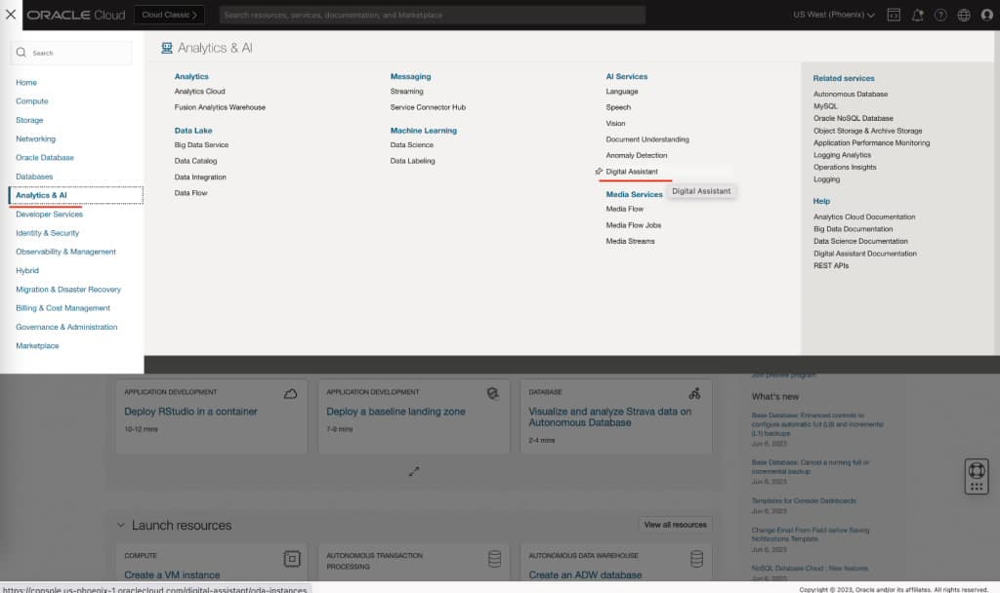

- Once the Digital Assistant Instances page is opened, click “Private endpoints” and select “Create private endpoint”:

- In the opened dialog you will need to select the compartment in which the ODA private endpoint should be managed, the virtual cloud network (VCN) and subnet in which the private endpoint should be created and the name of the private endpoint. Optionally you can specify the description, network security groups and tags.

- Once the ODA private endpoint is created, you can view its details.

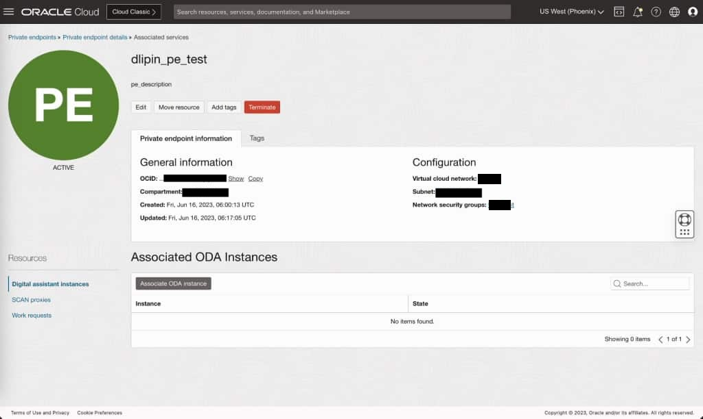

- In order to enable an ODA private endpoint to be used in Digital Assistant, you’ll need to associate this private endpoint with the Digital Assistant instance by clicking the “Associate ODA instance” button:

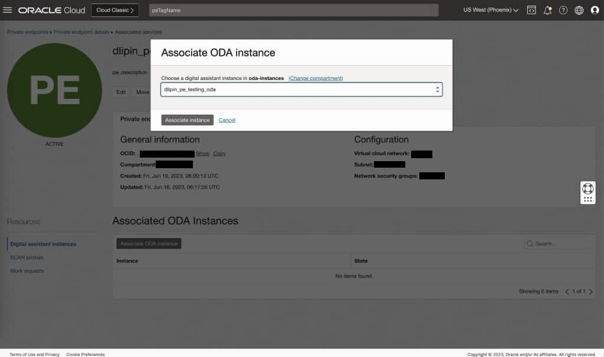

### Update REST APIs to use Private Endpoint

#### REST APIs in ODA to use Private Endpoint

Sign in to your ODA console.

- Next click on “settings” as shown below

Click on API Services -\> REST Services

You will see an option to enable Private Endpoint for this REST Service and to select one of the available private endpoints.

If you don’t see the Private Endpoint enablement option or list of available private endpoints is empty, then make sure you have associated the private endpoint with that ODA instance.

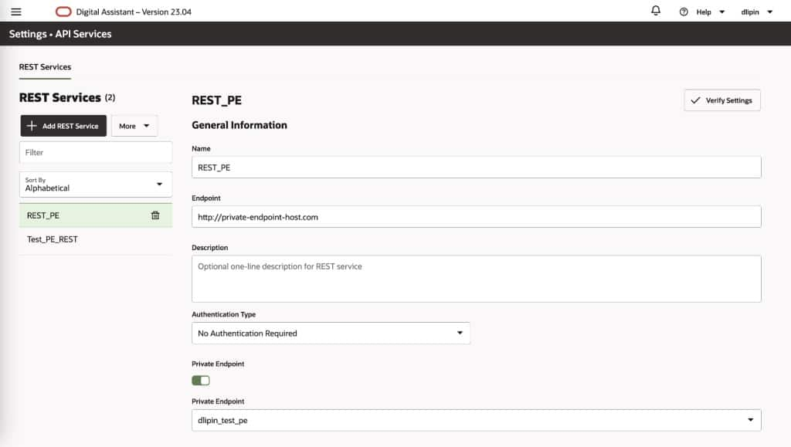

Note that the private endpoint feature is not supported by the custom component of ODA. Therefore, you may create a public load balancer is such cases.

## Troubleshooting 

1. Graph isn't showing in Table Graph VB App
    - Solution: Make sure to assign user role to idcs group in app settings

## [Return home](../../../README.md)