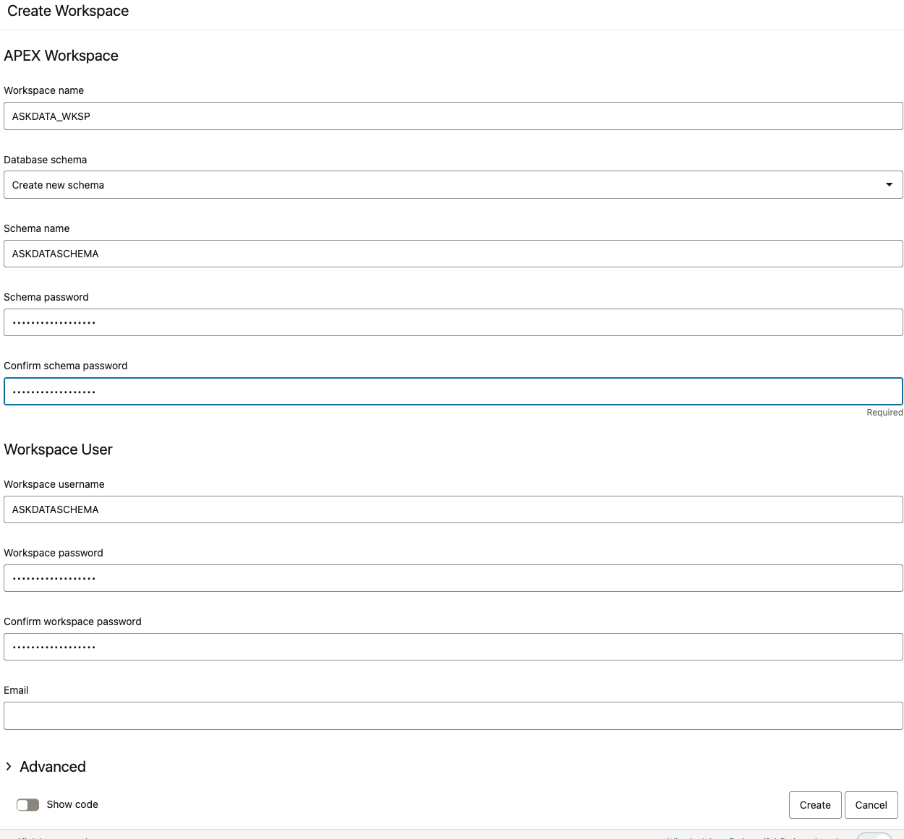

# 3.a ADW Update for Private API Gateway

# 1. Introduction

By default, ADW uses public endpoints for its communication to
supporting services. For using ADW with a private API gateway, see below.

For this to work, we will need the followings:

1.  Set the endpoint communication to use private endpoints.

2.  Create the ACL for the API Gateway

3.  Allow Access to the API Gateway to targeted users.

Note: **<u>All the actions described below are to be taken as the admin
user of the database. If possible this should be done by a DB
Expert.</u>**

**<u>Make sure that all components are in the same region and in the
same VCN. It was not tested in other configurations.</u>**

## 1.1. Not Covered Here

| **Element** | **Why and Discussion** |
|----|----|
| Making the ADW Private | This was tested on a two ADW in private subnets. The ADW were aready private. |
| Making the API Gateway Private | Same as for the ADW. |

# 2. Set the Endpoint Communication to Private.

Here we set the communication to use the private endpoint.

[Link to documentation](https://docs.oracle.com/en/cloud/paas/autonomous-database/serverless/adbsb/private-endpoints-autonomous.html#GUID-8FCA06C0-E1C1-49F6-82C2-6B7B3787CF3B)

| **Step** | **How** | **Why** |
|:--:|:--:|:--:|
| **Check the current configuration** | **SELECT \* FROM DATABASE_PROPERTIES WHERE PROPERTY_NAME = 'ROUTE_OUTBOUND_CONNECTIONS';** | **It should be empty, If not, verify with the creator of the database.** |
| **Set to private** | **ALTER DATABASE PROPERTY SET ROUTE_OUTBOUND_CONNECTIONS = 'PRIVATE_ENDPOINT';** | **Actually use private endpoints** |

> **Note**: For OCI DBs, you control outbound network access using VCNs , subnets , service gateways , or private endpoints , not by a SQL statement.
# 3. Create the Network ACL for the API Gateway

Now, we need to create the network ACL. This is for outbound ACL, as
opposed to the ones we create while creating the database.

This needs to be run with an admin user level.

BEGIN
  DBMS_NETWORK_ACL_ADMIN.create_acl(
    acl          => 'allow_http.xml',
    description  => 'Allow HTTP access',
    principal    => 'YOUR_DB_USER',   -- Replace with your database schema user
    is_grant     => TRUE,
    privilege    => 'connect'
  );
END;
/

[Documentation Link](https://docs.oracle.com/en/database/oracle/oracle-database/19/arpls/DBMS_NETWORK_ACL_ADMIN.html#GUID-0F55BDB0-D348-468E-BDBA-7314C6458FA1)

```sql 
BEGIN  
  -- 2. Assign the ACL to the hostname  
  DBMS_NETWORK_ACL_ADMIN.assign_acl(  
    acl  => 'allow_http.xml',  
    host => 'somewhere.apigateway.us-chicago-1.oci.customer-oci.com', -- \<-- the domain you are trying to reach  
    lower_port => 443,  
    upper_port => 443  
  );  
END;  
/
```

# 4. Allow Access to the API Gateway for Users

This will allow the users to access the server. The first one is created
and the remaining user are added to it.

This needs to be run with an admin user level.

[Documentation Link](https://docs.oracle.com/en/database/oracle/oracle-database/19/arpls/DBMS_NETWORK_ACL_ADMIN.html)

1.  Create the new network ability (allow html)

2.  Add users to this ability

  -- 1. Create the ACL (this creates /sys/acls/allow_http.xml inside
XDB)  

```sql
BEGIN
  DBMS_NETWORK_ACL_ADMIN.create_acl(
    acl          => 'allow_http.xml',
    description  => 'Allow HTTP access',
    principal    => 'ADMIN',   -- Replace with your database schema user
    is_grant     => TRUE,
    privilege    => 'connect'
  );
END;
/
```
  
  -- 2. Add APEX to the ACL 

```sql
BEGIN
 DBMS_NETWORK_ACL_ADMIN.ADD_PRIVILEGE(  
    acl          => 'allow_http.xml', -- file name  
  principal    => 'APEX_240200',  -- APEX  
    is_grant     => TRUE,  
    privilege    => 'connect'  
);  
END;
/
```
> **Note**: To find your apex number, you can run something like 

```sql
SELECT username
  FROM dba_users
 WHERE username LIKE 'APEX_%';
```

as admin.

```sql 
BEGIN
DBMS_NETWORK_ACL_ADMIN.ADD_PRIVILEGE(  
    acl          => 'allow_http.xml', -- file name  
  principal    => 'ASKDATASCHEMA',  -- Other if needed.  
    is_grant     => TRUE,  
    privilege    => 'connect'  
);  
END;  
/  
```
  
from
<https://support.oracle.com/knowledge/Oracle%20Cloud/2950076_1.html>  




```sql 
BEGIN  
  DBMS_NETWORK_ACL_ADMIN.APPEND_HOST_ACE(  
    host => 'somewhere.apigateway.us-chicago-1.oci.customer-oci.com', -- API Gateway host
    ace  => xs$ace_type(
              privilege_list  => xs$name_list('connect'),  
              principal_name  => 'ASKDATASCHEMA', -- Use schema (not workspace) name here  
              principal_type  => xs_acl.ptype_db
            )
  );  
END;  
/
```

> **Note**: Might need to add resolve privilege as well 

```sql
BEGIN
  DBMS_NETWORK_ACL_ADMIN.ADD_PRIVILEGE(
    acl         => 'allow_http.xml',
    principal   => 'ADMIN',          -- or your actual schema
    is_grant    => TRUE,
    privilege   => 'resolve'
  );
END;
/
```

(repeat for any other schemas e.g. apexschema)

```sql
BEGIN
  DBMS_NETWORK_ACL_ADMIN.ASSIGN_ACL(
    acl        => 'allow_http.xml',
    host       => 'somewhere.apigateway.us-chicago-1.oci.customer-oci.com'
  );
END;
/
```
# 5. Verification

## 5.1. Level 1, ACL Verification

The first level validation is to make sure that the ACL are properly
defined.

```sql
SELECT p.acl, p.principal, p.privilege, n.host, n.lower_port,
n.upper_port FROM dba_network_acl_privileges p, dba_network_acls n
WHERE p.acl=n.acl; 
```

Will tell you where the state of the ACL and if the requests you made
provided you with the acess you wanted.

## 5.2. Level 2, Access Verification

Try this procedure from the admin sql worksheet on the ADW server. It
will validate if the api gateway is visible from the database or not.

```sql 
DECLARE  
   l_http_request  UTL_HTTP.REQ;  
   l_http_response UTL_HTTP.RESP;  
   -- Private  
   l_url           VARCHAR2(255) := 'https://somewhere.us-chicago-1.oci.customer-oci.com/v1/admin_config';
   l_response      VARCHAR2(4000);  
BEGIN  
   l_http_request := UTL_HTTP.BEGIN_REQUEST(l_url);  
   l_http_response := UTL_HTTP.GET_RESPONSE(l_http_request);  
   UTL_HTTP.set_detailed_excp_support(TRUE);  
   UTL_HTTP.READ_TEXT(l_http_response, l_response);  
   DBMS_OUTPUT.PUT_LINE(l_response);  
   UTL_HTTP.END_RESPONSE(l_http_response);  
EXCEPTION  
   WHEN OTHERS THEN  
      DBMS_OUTPUT.PUT_LINE('SQLCODE: ' || SQLCODE);  
      DBMS_OUTPUT.PUT_LINE('Error: ' || SQLERRM); 
      DBMS_OUTPUT.PUT_LINE(UTL_HTTP.GET_DETAILED_SQLERRM);  
      DBMS_OUTPUT.PUT_LINE(DBMS_UTILITY.FORMAT_ERROR_BACKTRACE);  
      RAISE;  
END;  
/

```

## 5.3. Once verifications are Done

You can update the NL2SQL_Apex application substitution strings.

# 6. Open Questions

<table>
<colgroup>
<col style="width: 40%" />
<col style="width: 59%" />
</colgroup>
<thead>
<tr>
<th style="text-align: center;"><strong>Question</strong></th>
<th style="text-align: center;"><strong>Why</strong></th>
</tr>
</thead>
<tbody>
<tr>
<td>The validation procedure doesn't work from the APEX SQL
Workshop</td>
<td><p>I don't know why. At first I thought it was the user. I added the
user to the ACL but it didn't change anything. </p>
<p>I know it works because the APEX application works.</p></td>
</tr>
<tr>
<td></td>
<td></td>
</tr>
</tbody>
</table>

## [Return home](../../../README.md)
