# 2. APEX ADW Load Balancer

These instructions are for fronting a private ADW with a load balancer. 

> **NOTE**: At this point, there is an issue with the load balancer (because APEX doesn't like self-signed certificates). So we fall back on using the API Gateway.

So we are basing the configuration of the api gateway on this:
<https://blogs.oracle.com/ateam/post/oci-api-gateway-routes-quickly-and-easily>

------

> - **Note**: This page is inspired by the excellent blog <https://mattmulvaney.hashnode.dev/an-apex-vanity-url-for-load-balanced-oracle-managed-ords-for-adb-on-oci>
  - We are capturing here the sequence as relevant to this project.

- This page is a work in progress.

# High-level Process

1.  Create the private ADW Instance
2.  Enable the proper ports 443 and 1526 on the private subnet for communication.
3.  Create the load balance with the ADW as the backend.
4.  Update the DNS for the load balancer.
5.  Create the certificate and load it in the certificate manager
6.  Update the load balancer with the SSL Certificate
7.  Ensure the backend health is green
8.  Validate the load balancer.

# Dependency List

| **Name** | **Function** |
|----|----|
| Certificate Manager | Holds the Certificates for the SSL Configuration |
| APEX Trust Application | Provides the application presented by the load balancer |

# Network Configuration

- Port 443 needs to be opened and available to the APEX application
- Port 1526 on the ADW needs to be opened (not opened by the load balancer at this time).

# Configuration Steps

## Assumptions

<ol type="1">
<li>
The public name of the load balancer is known
</li>
<li>
The ADW Application has been created with a private endpoint
</li>
<li>
The ports 443 and 1526 are opened in the private subnet as ingress.
</li>
</ol>

## Create the load balancer
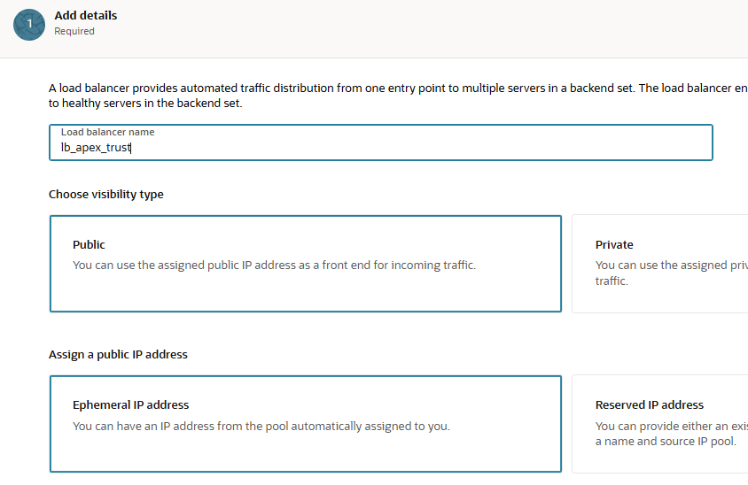

## Place it in the public subnet
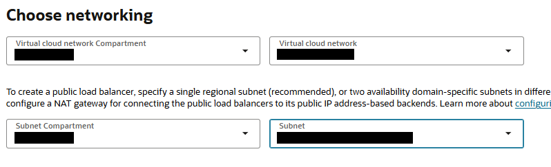

## Secure the load balancer
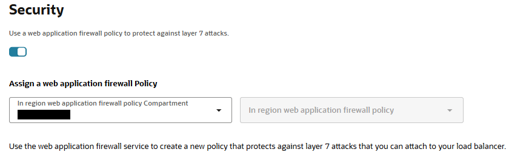

## Add the environment tag
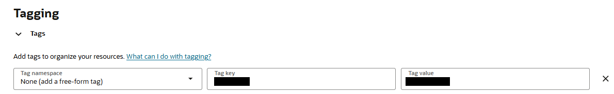

## Choose backend
**Do not select a backend at this time.**

## health policy
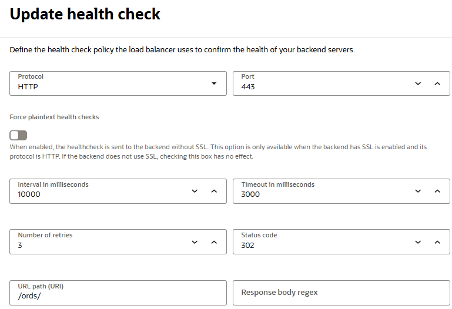

## Session Persistence
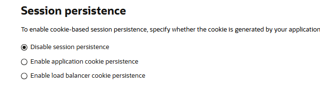

## Configure the listener for SSL
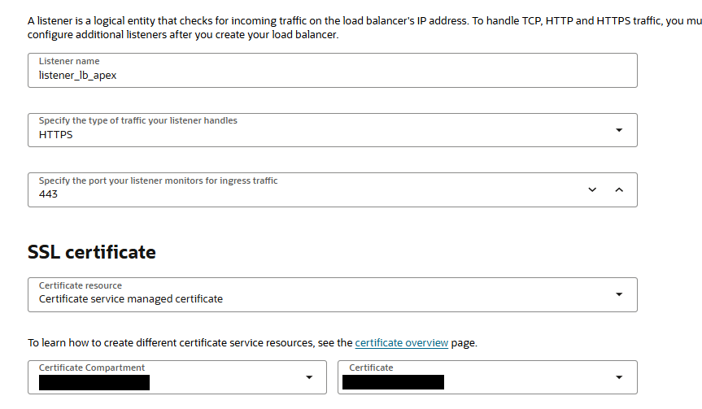

## SSL and cipher selection
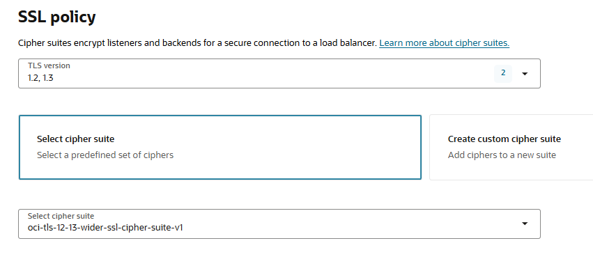

## Logging

Enable both error and access logs wih the system's log group

## Create the load balancer.
  **Expected Error**
**We don't have a backend**

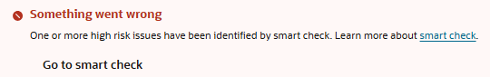

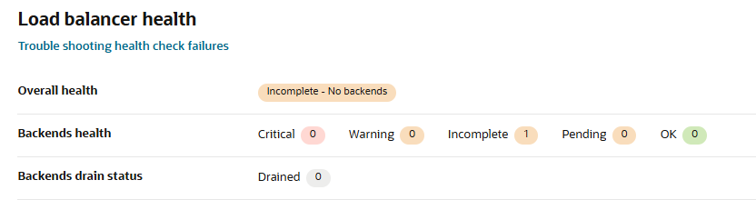

## Add a backend

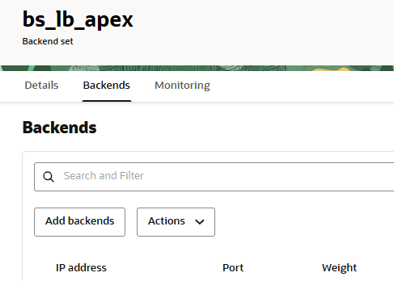

Take the private address from the Database

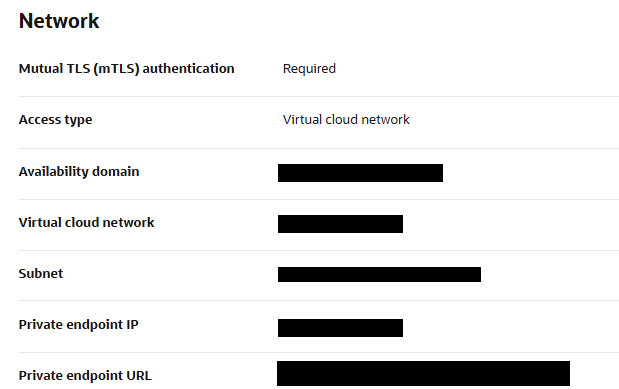

Add it as a backend for the load balancer.

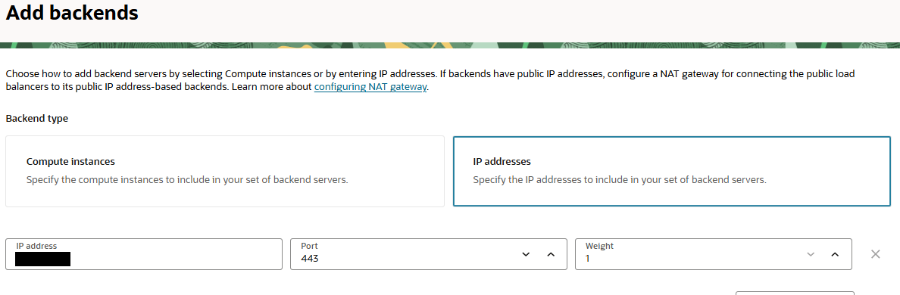

Add the hostname to the load balancer.

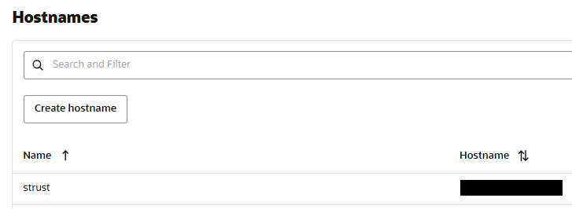

## Using let's encrypt for the SSL certificate

This step depends on how you generate the certificate.
`certbot certonly --logs-dir logs --work-dir work --config-dir config --authenticator dns-oci -d strust.nl2sql.dev`

## Register the certificate

<ul>
<li>Register the certificate in the central certificate manager.</li>
<li>Update the load balancer listener with the certificate and the host name.</li>
</ul>

## DNS Entry
Create the A record in the DNS matching the FQDN and the IP Address.
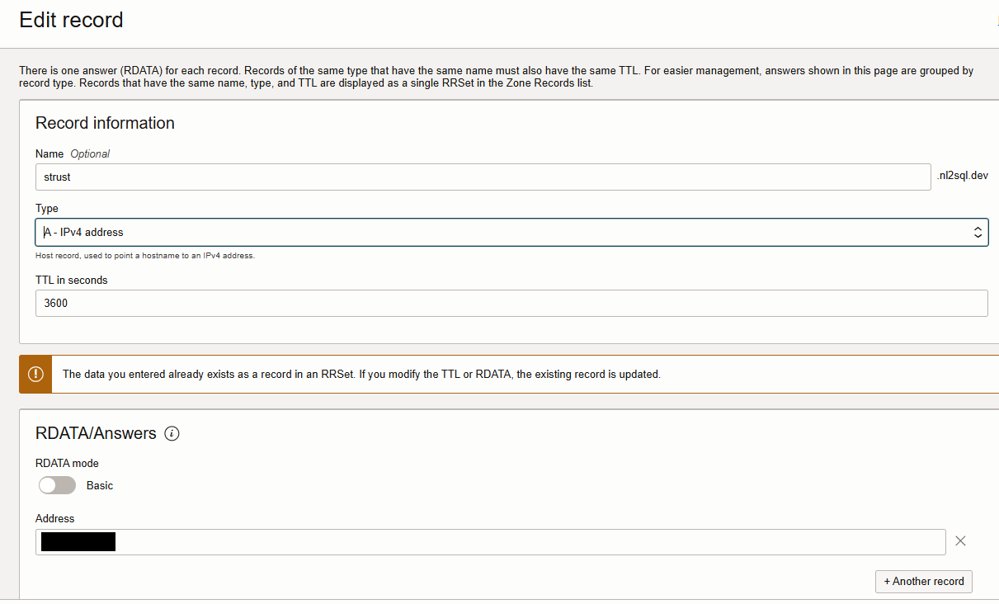

Certificate Bundle Registration in the central register

Create a certificate bundle with the same certificate as the SSL publication. (Used for the propagation to the backend)

That is basically the fullchain file from the let's encrypt generation.

Enable the backend set SSL connection and disable the peer verification.

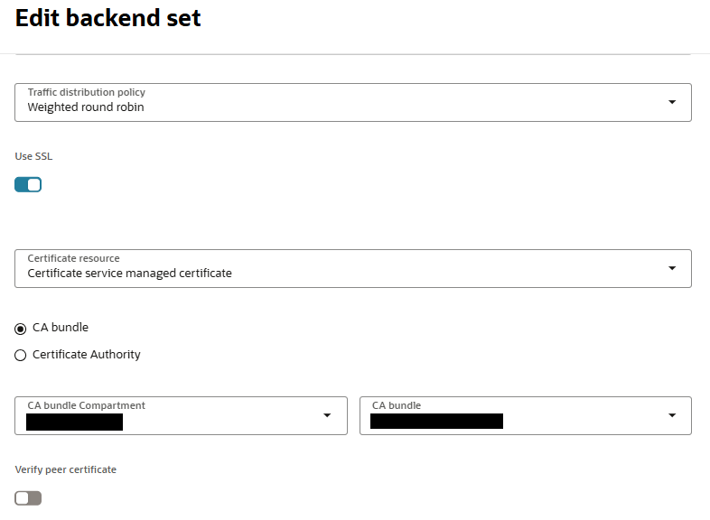

# Validation

Use the same validations API as with the trust service, but on the load
balancer address.

also from a browser access https://\<load balancer IP\>/

## [Return home](../../../README.md)