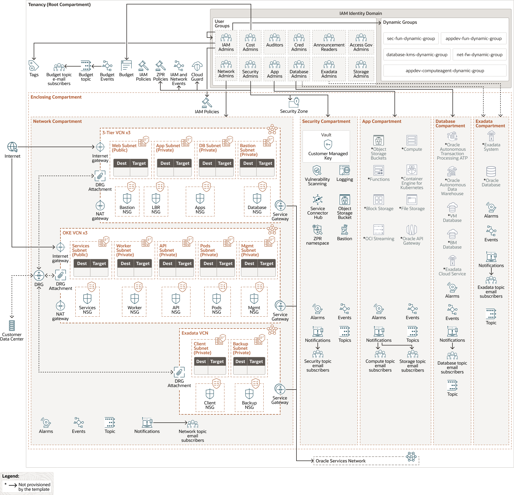
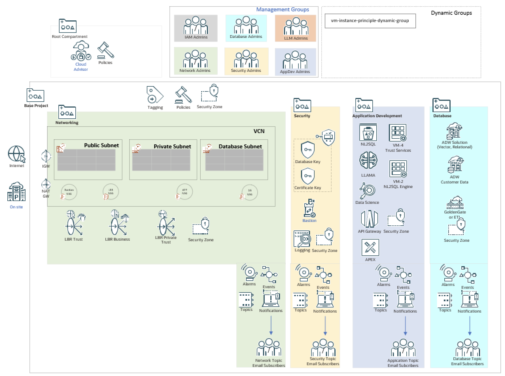
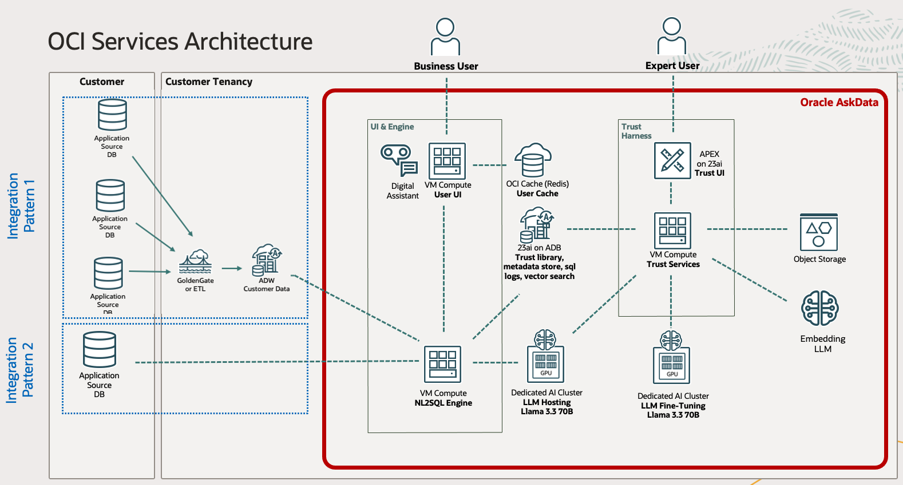

# Architecture

The system is deployed on the Oracle Cloud. To ensure that best practices are followed, the first layer of installation is over the landing zone installation Model. The AskData system then deploys the elements it will use and following the same deployment model.

## Deployment Architecture

The following images show the architecture of the OCI Landing Zone and the
AskData Solution. 

### OCI Landing Zone Complete Architecture

### AskData Deployment on CIS Landing Zone

### AskData Solution Architecture

This view shows the architecture, regardless of the underlying infrastructure.

## [Return home](../../../README.md)