## API Gateway

### Setup API Gateway

#### Create Gateway

1.  On the **Gateways** list page, select **Create Gateway**.

2.  Specify the following values for the new API gateway:

    - **Name:** The name of the API gateway. (for example,
      nl2sql-dev-apigw)

    - **Type:** The type of API gateway to create. **Public**

    - **Compartment:** The compartment in which to create the
      API gateway.

    - **Virtual cloud network in \<compartment-name\>:** The VCN in
      which to create the API gateway. (for example, genai-demo-vcn)

    - **Subnet in \<compartment-name\>:** The public or private regional
      subnet in which to create the API gateway. (for example, public
      subnet-genai-demos-vcn). allow traffic on port 443.

> Note that unlike public API gateways, APIs fronted by a private API
> gateway won’t be accessible from VBCS and ODA as-is. Therefore,
> additional configuration is required. These configurations are
> explained in the respective sections.

- **Enable Network Security Groups:** Disabled

- **Certificate:**  **Default (\*.oci.customer-oci.com)** 
 

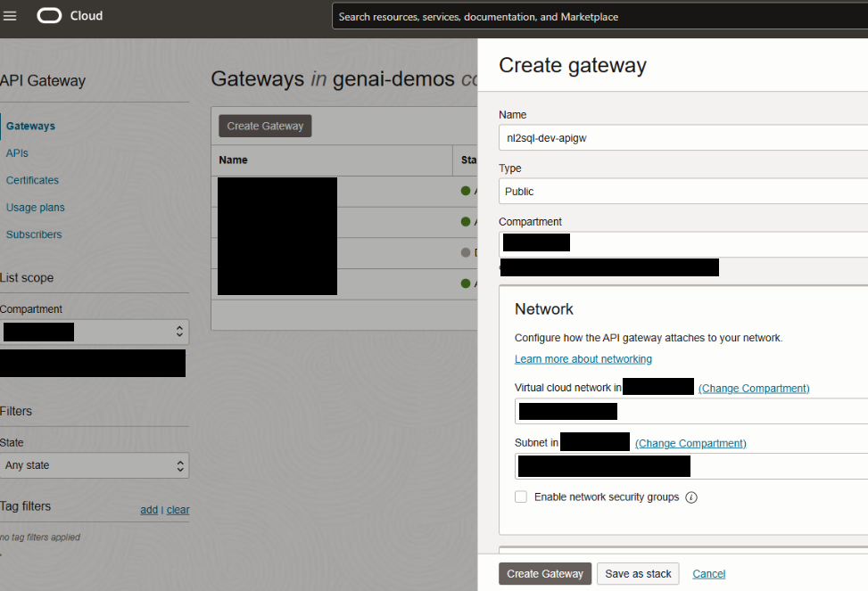

3.  Select **Create Gateway** to create the API gateway immediately.

### Create Deployment

#### Create API Deployment

1.  On the **Gateways** list page, select the API gateway on which you
    want to deploy the API. (for example, nl2sql-dev-apigw)
2.  On the **Gateway Details** page, select **Deployments** from
    the **Resources** list, and then select **Create Deployment**.

 

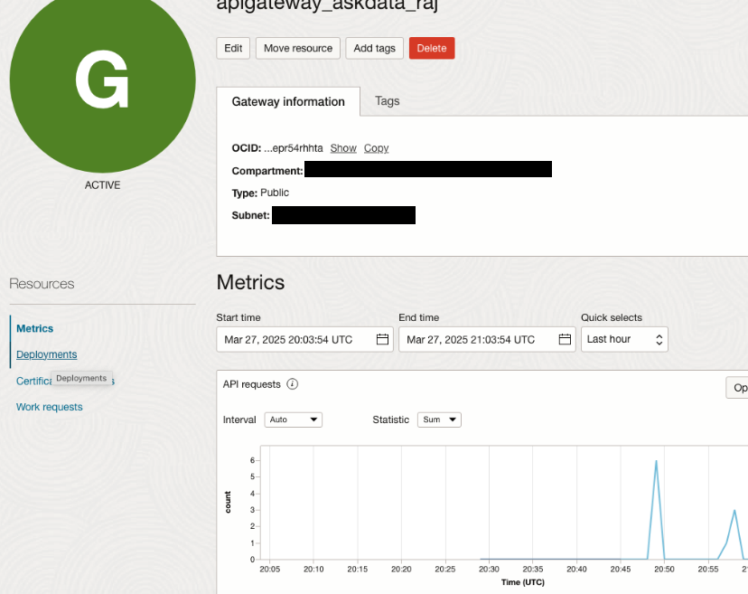

 

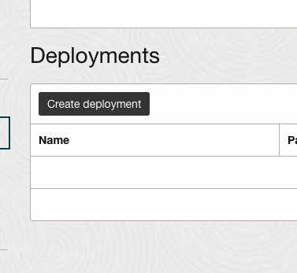

3.  Select **From Scratch** and in the **Basic Information** section,
    specify:

    - **Name:** The name of the new API deployment. Avoid entering
      confidential information. (for example, ws)

    - **Path Prefix:** A path on which to deploy all routes contained in
      the API deployment specification. For example:

      - /v1

    - **Compartment:** The compartment in which to create the new
      API deployment. 

 

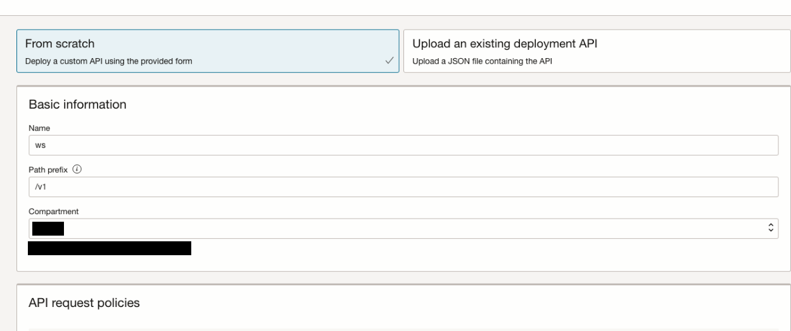

4.  (Optional) In the **API Request Policies** section, optionally
    specify request policy details to provide support for:

    - **Mutual-TLS:** Select **Enable mTLS** and enter details for an mTLS request policy. Default - unchecked
    - **Authentication:** Select **Add** and enter details for an authentication request policy. Default - none
    - **CORS:** Select **Add** and enter details for a CORS request policy. Default - none
    - **Rate Limiting:** Select **Add** and enter details for a rate limiting request policy. Default – none

 

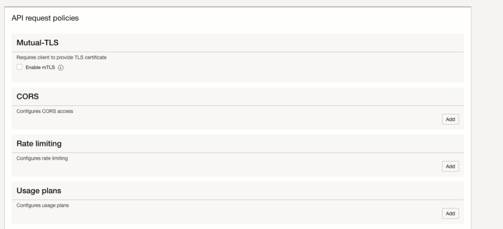

5.  (Optional) In the **API Logging Policies** section, optionally
    specify an execution log level to record information about
    processing within the API gateway. (for example, Information)

6.  (Optional) Select **Show Advanced Options** and optionally specify:

    - **Tags: **Default - none

 

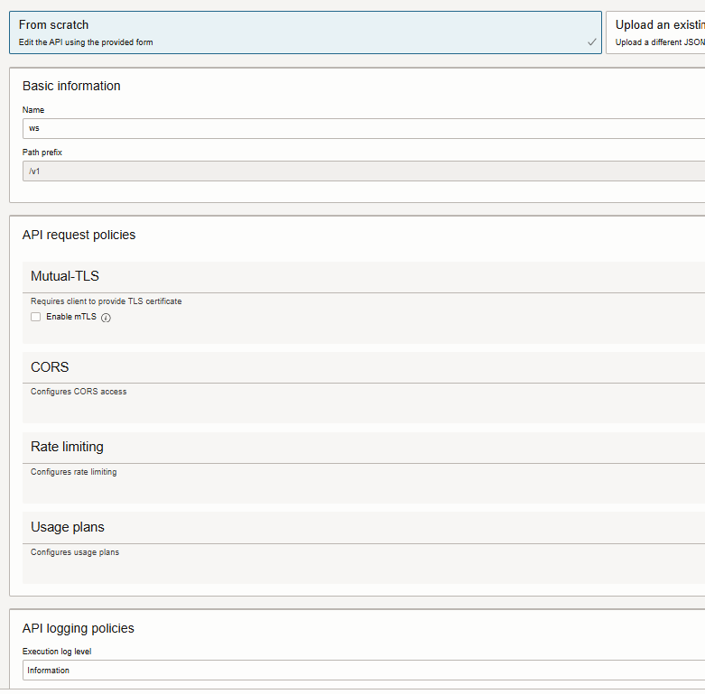

7.  Select **Next** to display the **Authentication** page and enter
    details for an authentication request policy:

    - **Single Authentication:** Select to route all authentication requests to a single authentication server.
    - **Enable anonymous access:** disabled
    - **Authentication type:** OAuth 2.0/OpenID Connect
    - **Token location:** Header
    - **JWT token header name:** Authorization
    - **Authentication schema:** Bearer

 

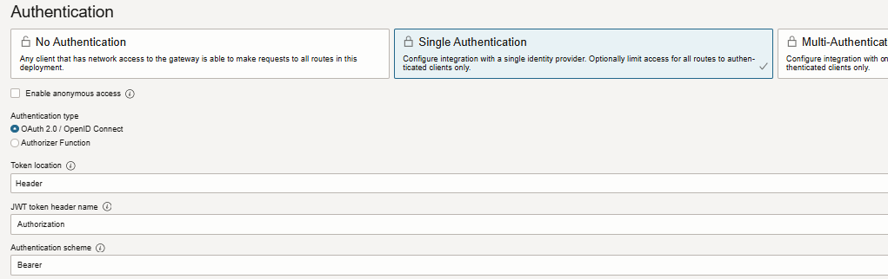

- **Validation type:** OAuth 2.0 introspection endpoint

- Provide **Client ID** of the confidential app that created, **Secret**
  stored in vault and the **Discovery URL** from the IDCS application.

- **Client ID:** Client ID value specified in the confidential
  application

- **Client secret**
  - **Vault** in \<compartment\>: 
  - **Vault secret** in \<compartment\>: 
  - **Vault secret** version number: 1

- **Discovery URL**: (for example, <https://your-idcs-server.oraclecloud.com:443/.well-known/openid-configuration>)

 Format:

IDCS baseurl can be found at this location.

 

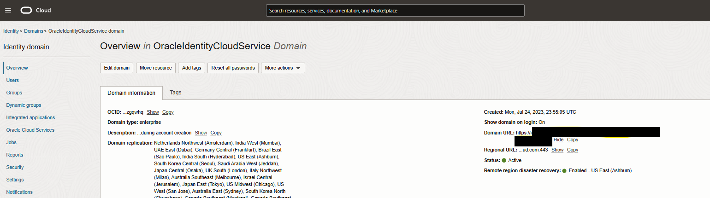

- **Maximum cache duration in hours**: 1
- **Max clock skew in seconds**: 0
- **Disable SSL verification**: Disabled

 

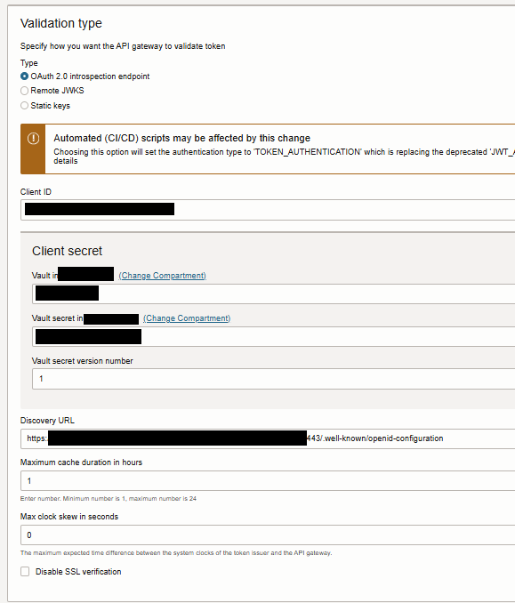

- **Issuers**
  - **Allowed issuers:**

(for example:

> <https://identity.oraclecloud.com/>
> <https://idcs-server.identity.oraclecloud.com>

> Add each item on a separate line)

- **Audiences:** \<leave it blank\>

- **Claims validation:** \<leave it blank\>

 

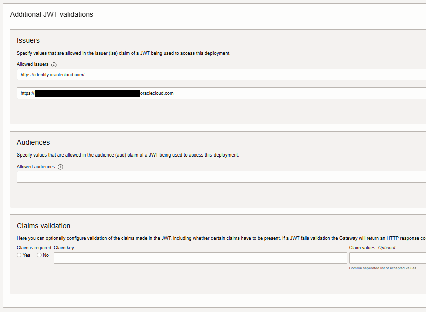

- **Validation failure policy**
  - Type: OAuth2.9 redirect client to identity provider
  - Scopes: openid
  - Response type: CODE
  - Use Oauth2 introspection endpoint client credentials: enabled

 

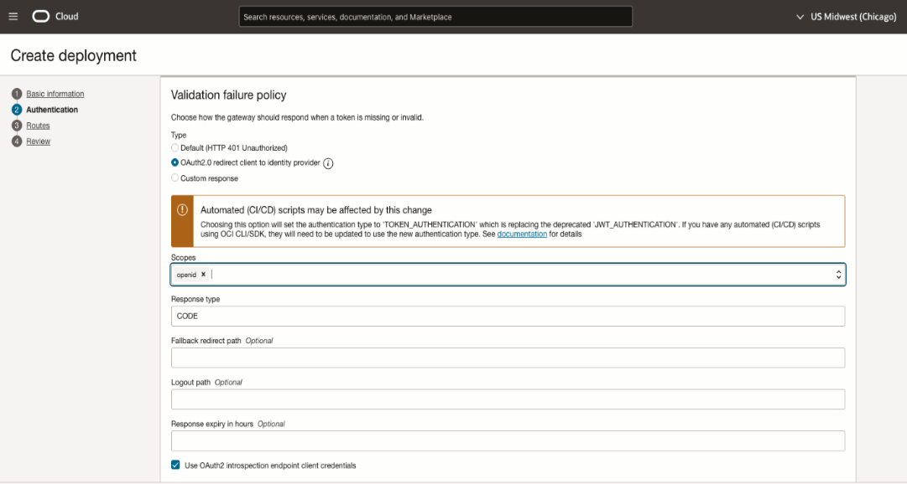

8.  Select **Next** to enter details of the routes in the API
    deployment.

9.  In the **Route 1** section, specify the first route in the
    API deployment that maps a path and one or more methods to a
    back-end service:

    - **Path:** /prompt
    - **Methods:** ANY
    - **Add a single backend** 
    - **Backend Type:** HTTP
    - **URL:** (for example, <http://10.x.x.xxx:8000>)
    - **Connection established timeout in seconds:** 60
    - **Request transmit timeout in seconds:
      300**
    - **Reading response timeout in seconds:
      300**

 

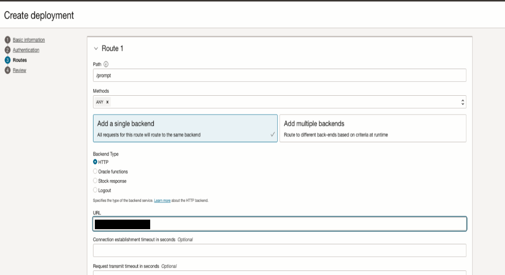

 

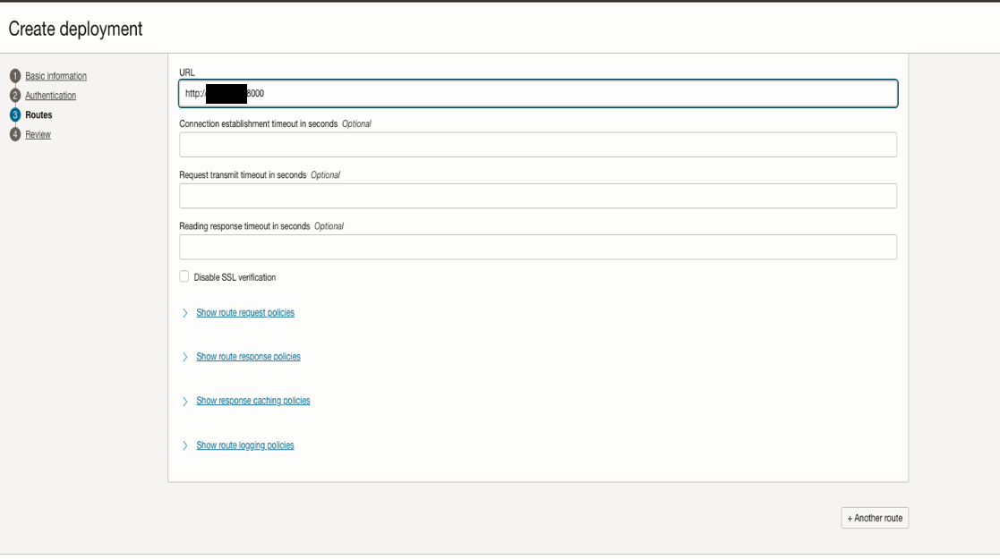

10. (Optional) Select **Another Route** to enter details of additional
    routes.

11. In the **Route 2** section:

    - **Path:** /feedbackupdown
    - **Methods:** POST
    - **Add a single backend** 
    - **Backend Type:** HTTP
    - **URL:** (for example, <http://10.x.x.xxx:8000/v1/feedbackupdown>)
    - **Connection established timeout in seconds:** 60
    - **Request transmit timeout in seconds:
      300**
    - **Reading response timeout in seconds:
      300**

 

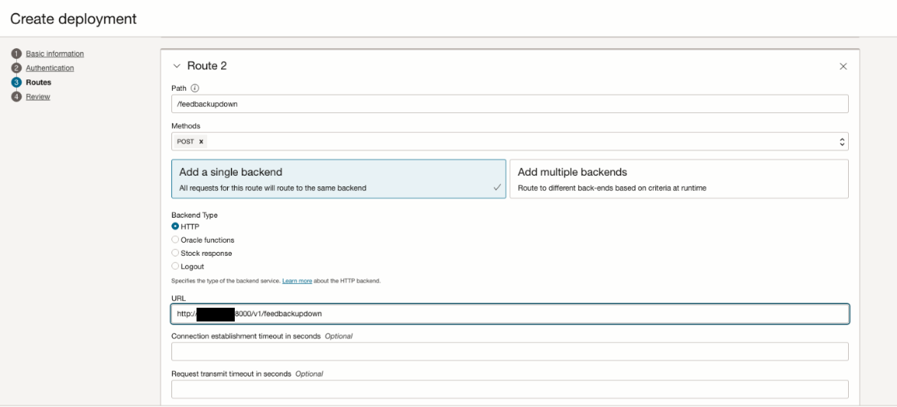

12. (Optional) Select **Another Route** to enter details of additional routes.
13. In the **Route 3** section:
    - **Path:** /feedbackmessage
    - **Methods:** POST
    - **Add a single backend** 
    - **Backend Type:** HTTP
    - **URL:** (for example, <http://10.x.x.xxx:8000/v1/feedbackmessage>)
    - **Connection established timeout in seconds:** 60
    - **Request transmit timeout in seconds:
      300**
    - **Reading response timeout in seconds:
      300**

 

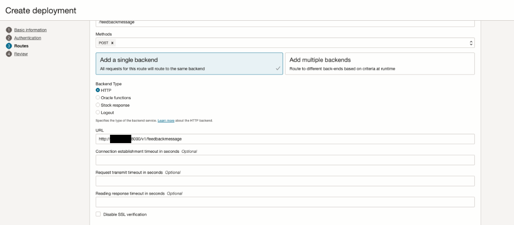

14. In the **Route 4** section:
    - **Path:** /getdata/
    - **Methods:** ANY
    - **Add a single backend** 
    - **Backend Type:** HTTP
    - **URL:** (for example, <http://10.x.x.xxx:8000/getdata/> )
    - **Connection established timeout in seconds:** 60
    - **Request transmit timeout in seconds:
      300**
    - **Reading response timeout in seconds:
      300**

 

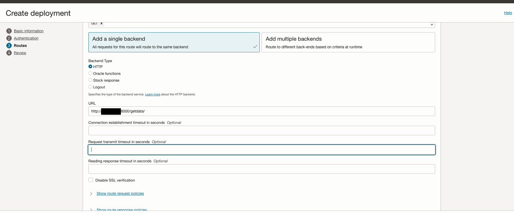

15. In the **Route 5** section:
    - **Path:** /igraph/
    - **Methods:** ANY
    - **Add a single backend** 
    - **Backend Type:** HTTP
    - **URL:** (for example, <https://10.x.x.xxx:8000/igraph/> )
    - **Connection established timeout in seconds:** 60
    - **Request transmit timeout in seconds:
      300**
    - **Reading response timeout in seconds:
      300**

 

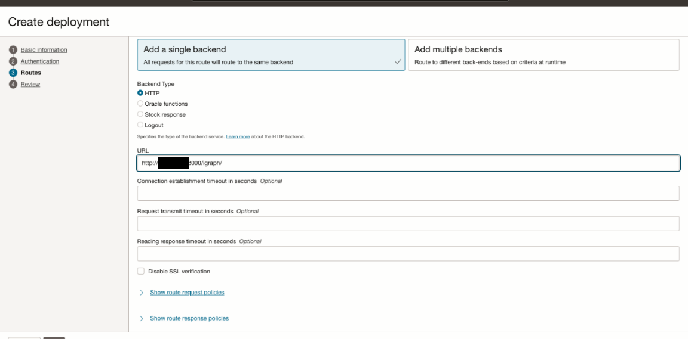

16. Select **Next** to review the details you entered for the new API deployment.

4.  Select **Create** to create the new API deployment.

 

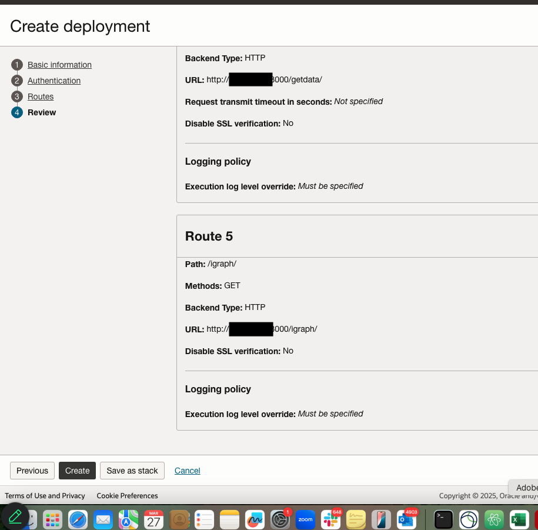