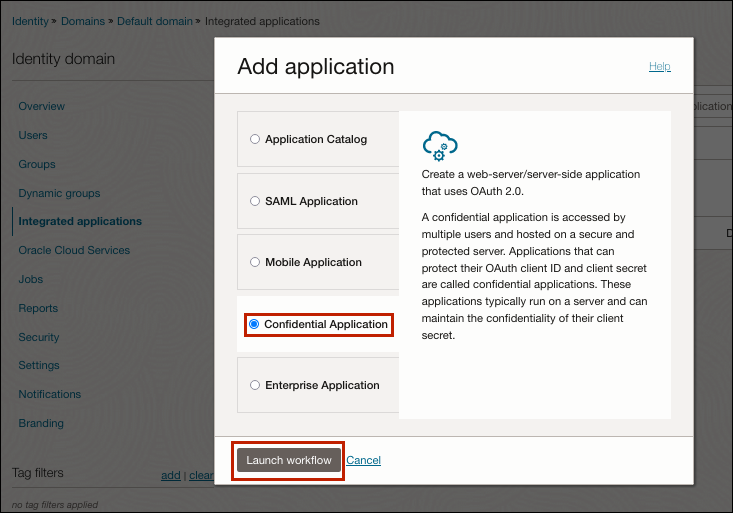

## IDCS Application

### Setup IDCS Application

#### Confidential Application

1.  Sign in to your Oracle Cloud account as an administrator.
2.  In Oracle Cloud Infrastructure Console, navigate to **Identity & Security**, and click **Domains**.
3.  Select \<Domain\>
4.  Click the name of the identity domain, and click **Integrated applications**.

 

5.  Click **Add application**, select **Confidential Application**, and then click **Launch workflow**.

 

6.  Enter a name for the application (for example, nl2sql_dev_01), and click **Next**.

 

7.  Select **Configure this application as a client now**.
8.  Under **Authorization**, select the allowed grant types: **Resource
    Owner**, **Client credentials, JWT assertion, Refresh token, Device
    code, Authorization code, Implict, SAML2 assertion**, and **TLS
    client authentication**.

Allow non-HTTPS URLs: Enabled (Disabled)

 Redirect URL: \<oda url\> (for example,
 [https://oda-instance.data.digitalassistant.oci.oraclecloud.com/connectors/v1/callback](https://oda-instance.data.digitalassistant.oci.oraclecloud.com/connectors/v1/callback))

 ***Note, redirect URL will be changed later, for now give any URL.
 Upon provisioning an ODA instance, you need to return back to the
 section and replace it with an ODA based url.***

 ***Format: https://\<oda-base-url\>connectors/v1/callback***

 Client type: Confidential

 Allowed operations: Introspect

 Client IP address: \<either select nothing or select ‘Anywhere’\>

 Web tier policy: Skip and do later

 

 *Pick introspect and other options as shown*

 

 

9.  Click **Next**, then **Finish**.
10. Click **Activate**, then **Activate Application**.

 

