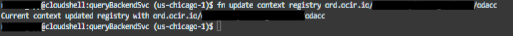

#	Oracle Function

This section is included to address the cold start performance issue with ODA’s custom component. Implement this section only if you are using the skill that utilizes an Oracle Function, as described in the section - Import ODA Skill

## 4.1.	Create Dynamic Group

### 4.1.1.	Dynamic Group

1.	In the Infrastructure Console, click the  on the top left to open the navigation menu, select Identity & Security, select Domains, select <Domain>, and then click Dynamic Groups.
2.	Click Create Dynamic Group to open the Create Dynamic Group dialog.
3.	Fill in values for Name and Description.
The name must be unique across all groups in your tenancy (dynamic groups and user groups). You can't change this later.
Name: nl2sql-oda-dynamic-group
Description: <enter description>
4.	In the Matching Rules section, add one or more rules to match the instance or instances that you want to have access to the component.
You can add rules for instances or for compartments that contain the instances.

Tip:
Click the Rule Builder link to get assistance with the rule syntax.
Here are rules that you could use for Digital Assistant instances in a specific compartment.

```md
resource.type = 'odainstance',
resource.compartment.id = '<ocid-of-compartment-containing-DigitalAssistant-instance>'
```


Example:-
 
```md
resource.type = 'odainstance'
resource.compartment.id = 'ocid1.compartment.oc1..xxx'
```

5.	Click Create.


 
## 4.2.	Create Policy

### 4.2.1.	Create a Policy to Access Oracle Functions

1.	In the Infrastructure Console, click the  on the top left to open the navigation menu, select Identity & Security, and then click Policies.
A list of the policies in the compartment you're viewing is displayed.
2.	From the list of compartments, select the compartment to which you want to attach the policy. This controls who can later modify or delete the policy (see Policy Attachment).
3.	Click Create Policy. [Alternatively, you may use an existing policy]
4.	Complete the wizard, paying particular attention to the following fields:
- 	Name: Enter a unique name for the policy. The name must be unique across all policies in your tenancy. You cannot change this later.
- 	Statement: Enter a policy statement with the following format:
Allow dynamic-group <name_of_your_dynamic_group> to use fn-invocation in compartment id <ocid of Functions_compartment>
Example:

```md
Allow dynamic-group nl2sql-oda-dynamic-group to use fn-invocation in compartment id ocid1.compartment.oc1..xxx
Allow any-user to use fn-invocation in compartment id <ocid of Functions_compartment> where all {request.principal.type='odainstance', request.principal.compartment.id='<ocid of Functions_compartment>'}
```

Example: 

```
Allow any-user to use fn-invocation in compartment id ocid1.compartment.oc1..xxx where all {request.principal.type='odainstance', request.principal.compartment.id='ocid1.compartment.oc1..xxx'}
```

## 4.3.	Generate Auth Token

### 4.3.1.	Generate Auth Token for Container Registry

If you already have an auth token, go to the next step. Otherwise:
1.	In the top-right corner of the Console, open the Profile menu , and then select User settings (or My Profile or your account name) to view the details.
2.	On the Auth Tokens page, select Generate Token.
3.	Enter a friendly description for the auth token. Avoid entering confidential information.
4.	Select Generate Token. The new auth token is displayed.
5.	Copy the auth token immediately to a secure location from where you can retrieve it later, because you won't see the auth token again in the Console.


6.	Close the Generate Token dialog.


## 4.4.	Create Function Application

### 4.4.1.	Create Application
1.	Log in to the console (as a functions developer)
2.	Open the navigation menu and select Developer Services
3.	Select Applications under Functions
4.	Select the compartment
5.	Select Create Application
6.	Enter a name for the new application, askdata_nl2sql_fn_app
Note: keep the same name as it is being referred in other places.
7.	Specify the VCN and subnet where the function will run
8.	Select Shape, GENERIC_ARM. [as cloud shell used for deploying functions has ARM architecture, otherwise the deployment will fail]
9.	Select Create
 


## 4.5.	Deploy OCI Function

### 4.5.1.	Deploy Function

We will use Cloud Shell for deploying functions

1.	Open Cloud Shell 
 
 

 

2.	Download Oracle function custom component code from code repository

Example: queryBackendSvc.zip

3.	Upload the above downloaded Oracle function custom component code into Cloud Shell user session
 


 


4.	Unzip the file, run npm install

```bash
$ unzip <file name>
$ unzip queryBackendSvc.zip
$ cd queryBackendSvc
$ npm install
```

5.	List context

```bash
$ fn list context
```


 
6.	Use Context

fn use context <context name from the above list>

```bash
$ fn use context us-chicago-1
```


7.	Update context with function's compartmemt
fn update context <ocid of the function application compartment>

```bash
$ fn update context oracle.compartment-id ocid1.compartment.oc1..xxx
```


 
8.	Provide a unique repository name

fn update context registry <region key>.ocir.io/<tenancy-namespace>/<repo. name>
Example: Region key of Ashburn is iad, Phoenix is phx, Chicago is ord

```bash
$ fn update context registry ord.ocir.io/<tenancy-name>/odacc
```
 

 
9.	Login to the docker with auth token
docker login -u '<tenancy namespace>/<identity provider>/<username>' <region key>.ocir.io

```bash
$ docker login -u '<tenancy>/oracleidentitycloudservice/user@example.com' ord.ocir.io
```

 
 
10.	Deploy function

fn -v deploy --app <function application name>

```bash
$ fn -v deploy --app askdata_nl2sql_fn_app
```


 
11.	Verify the deployed function
•	Go to Developer Services  Functions  Applications
•	Open askdata_nl2sql_fn_app
•	Navigate to tab, Functions
•	You should see function, querybackendsvc


 
•	Make a note of Invoke Endpoint URL. You will update ODA skill with this URL.
Open function – querybackendsvc


 


## 4.6.	Update Provisioned Concurrency Units

### 4.6.1.	Update PCU

To address the cold start performance issue, increase the provisioned concurrent units value of the function.
-	Open Functions, querybackendsvc
-	Click ‘Edit’
-	You may need to change compartment to the root compartment.
 
 

-	Enable Provisioned concurrency button
-	Increase Provisioned concurrency units. It should be in the multiples of 40 since the memory size of the function by default is 128 MB. 
 
 

-	Save changes


## 4.7.	Update Functions Invocation Timeout

### 4.7.1.	Update timeout

Increase the maximum amount of time the function can run
-	Open Functions, querybackendsvc
-	Click ‘Edit’


 
-	Increase Synchronous invocation timeout
-	Save changes

## [Return to ODA](../deployment/oda.md#deploy-oda-code-–-skill)
## [Return home](../../../README.md)