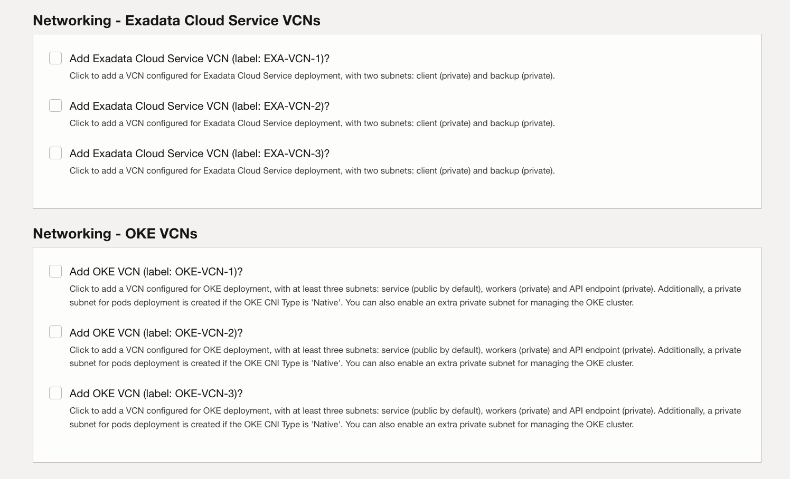

# Landing Zone

This chapter provides instructions for deploying OCI CIS 2.0 Landing Zone with OCI Stacks and deploying Ask Data components using terraform.

## Overview

The following services are deployed as part of the solution, the components are distributed based on whether these are deployed with the LZ Stack or by custom TF Code.

### Landing Zone Components
Listed here are the cloud standard components created as part of the landing zone installation.

    1. Network Compartment
    2. Security Compartment
    3. App Compartment
    4. Database Compartment
    5. VCN
    6. Subnets
    7. DRG
    8. Internet Gateway
    9. Service Gateway
    10. IAM Dynamic Groups
    11. IAM Groups
    12. IAM Policies
    13. Alarms, Events, Topics and Notifications
    14. Vault
    15. Object Storage

### Custom Terraform Components
The following are components required by the application.

    1. Business ADW
    2. Trust/APEX ADW
    3. Business API GW
    4. Trust API GW
    5. Object Storage Bucket
    6. APEX IDCS Confidential App
    7. APIGW IDCS Confidential App
    8. IAM Dynamic Group for Instance Principal
    9. IAM Policy for Instance Principal
    10. NL2SQL Engine Application VM
    11. Trust Python Application VM
    12. Trust Load Balancer
    13. Log Group
    14. Digital Assistant (oda)
    15. Redis Cluster (OCI Cache)
    16. API Gateway Confidential App Vault Secret
    17. DB Password Vault Secret
    18. VBCS Deployment

## Artifact Location

Following table lists the locations for the LZ Quickstart GitHub Page as
well as the Custom Terraform script location.

| **Artifact** | **Location** |
|:---|:---|
| Landing Zone Quick Start | <https://github.com/oci-landing-zones/terraform-oci-core-landingzone> |
| Terraform for AskData | <tbd-terraform-location> |

. Artifact Location for Landing zone and Custom Terraform Script

## Deployment Procedure

### OCI Landing Zone

Follow below procedure to deploy the OCI CIS Landing zone in your tenancy.

NOTE: While deploying the Landing Zone, either use the tenancy administrator account or assign the necessary permissions needed to deploy the LZ components.

1. Visit the OCI CIS Landing Zone terraform github page at
    <https://github.com/oci-landing-zones/terraform-oci-core-landingzone?tab=readme-ov-file>.
    

2. Scroll down on the page and click on

3. Login to your tenancy with tenancy admin account.
 

4. After logging in, you get to the Create stack page, On the create stack page you have to;
    1. Select the checkbox to accept the terms of use.
    2. Provide a name for the stack.
    3. Select the compartment to create the stack in.
    4. Click Next.
 

5. On the Configure variables page provide the deployment details.
6. In the general section, you need to;
    1. Select the region to deploy the LZ.
    2. Select CIS Level 1.
    3. Provide a service label that will be appended to all the components deployed by the LZ (For example nl2sqldemo).
 

7. On the Configuration Options panel;
    1. Select the Checkbox to Customize Default IAM Settings
    2. Select the Checkbox to Define Networking Topology.
    3. Leave the other options at default if deploying for a PoC or a demo, otherwise configure the LZ based on Customer requirement.
 

8. On the Compartments page.
    1. Select ‘**Yes, deploy new**’ under ‘**Deploy Compartments in Enclosing Compartment?**’
    2. Select the compartment to deploy the LZ components.
    3. Leave the ‘**Deploy ExaCS Infra Compartment?’** Unchecked.
 

9. Under Identity Domains;
    1. Select the **identity domain.**
 

10. Under Groups (Default Identity Domain)
    1. Select **Yes** to deploy new Groups.
 

11. Under Dynamic Groups (Default Identity Domain)
    1. Select **Yes** to deploy new dynamic groups.
 

12. Under Policies
    1. Select **CREATE** to create new policies in the Root compartment.
 

13. Under Network Topology
    1. Select **No cross VCN or on-premises connectivity**.
 

14. Under Networking – Three Tier VCNs
    1. Select **Add Three-Tier VCN (label: TT-VCN-1)?**
    2. Provide VCN Name.
    3. Provide the CIDR Block for the VCN.
    4. Leave everything else at default or customize based on customer input.
 

15. Leave everything at default under the Exadata and OKE Networking Section.
 

16. Provide the email address for the notifications in the Events and Notifications section.
 

17. Click on **Next**.
 

18. On the **Review** page, make sure the **Run Apply** is selected and click on **Create**.
 

19. After the apply job is completed, you will have the base landing zone ready for AskData Deployment.

## [Return home](../../../README.md)