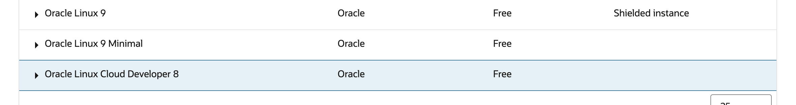

## VM1 - Engine

### VM Setup – Provision VM Instance

### Prerequisites 

This section assumes the following resources are configured: 
* [Policies & Dynamic Groups](./generic.md#dynamic-groups)
* [Business & Trust ADBs](./database.md)
* [OCI Cache Cluster](https://docs.oracle.com/en-us/iaas/Content/ocicache/createcluster.htm#top) 
* [VCN](https://docs.oracle.com/en-us/iaas/Content/Network/Tasks/quickstartnetworking.htm#Virtual_Networking_Quickstart)
    - Ingress rules are added to security list allow traffic from public/private subnet on port 8000 & 8002 


> **Note** There is a partial dependency on the VB apps in the configuration file; however you can proceed for now without the VB apps and return later to populate the VB app endpoints. 

#### Provision VM Instance

1.  Go Instances and Create Instance:

<br>


2.  Give a meaningful name:

<br>


3.  Pick an image – pick *Oracle Linux Cloud Developer 8*

<br>


<br>


<br>



4.  Adjust shape 2 or more oCPUs, 16GB or more RAM

<br>


5.  Add SSH key:

<br>


6.  Pick custom boot volume

<br>


7.  Finally Create the instance

### VM Setup – Configuring VM Instance

#### Configuring VM Instance

1.  Now start configuring the instance
2.  SSH into the box as opc user
3.  Adjust the boot volume size:

```
sudo lsblk
sudo parted /dev/sda print
sudo parted /dev/sda
resizepart 3 100%
quit

sudo pvresize /dev/sda3
sudo vgdisplay ocivolume
sudo lvextend -l +100%FREE /dev/ocivolume/root
sudo xfs_growfs /
```

4.  Switch python version:  
    `sudo update-alternatives --config python3`

Above command will display 2 options. Pick the option for python 3.11 (most probably you will be picking option 2)

5.  Correct pip version:

``` bash
sudo dnf install python3.11-pip
sudo update-alternatives --install /usr/bin/pip pip /bin/pip3.11 40
which pip
pip --version
```

in the command above make sure pipe version is also 3.11

6.  Open Local Firewall

``` bash
sudo firewall-cmd --add-port=8000/tcp --permanent
sudo firewall-cmd --add-port=1521/tcp --permanent
sudo firewall-cmd --add-port=6379/tcp --permanent
sudo firewall-cmd --add-port=8001/tcp --permanent
sudo firewall-cmd --add-port=8001/tcp --permanent
sudo firewall-cmd --add-port=8002/tcp --permanent
sudo firewall-cmd --add-port=8003/tcp --permanent
sudo firewall-cmd --add-port=80/tcp --permanent
sudo systemctl restart firewalld
```

7.  Install python Libraries:

``` bash
sudo pip install spacy # - done
sudo pip install requests
sudo pip install redis
sudo pip install sqlalchemy
pip install --upgrade snowflake-sqlalchemy # -new one
sudo pip install pandas
sudo pip install fastapi # -- done
sudo pip install oracledb
sudo pip install seaborn matplotlib --upgrade
sudo pip install numpy
sudo pip install oci # - done
sudo pip install oracledb --upgrade
sudo pip install openpyxl
sudo pip install sql-metadata
sudo pip install ubicorn # -Not working (library doesnot exist)
sudo pip install uvicorn
sudo pip install --upgrade sqlalchemy
sudo pip install --upgrade oci
sudo pip install oracledb
sudo pip install oci --upgrade
sudo pip install oracledb --upgrade
sudo pip install oracledb --upgrade
sudo pip install faiss-cpu
sudo pip install sentence-transformers
sudo pip install 'uvicorn\[standard\]'
sudo pip install plotly
sudo pip install -U kaleido
sudo pip install sseclient
sudo pip install simplejson
# *(DONE)*
sudo pip install sseclient-py
```

8.  Add user auth keys

- Make directory called “.oci “ under /home/opc
- cd .oci
- make file called “config”
add details from your auth key into config:

```
user=
fingerprint=
tenancy=
region=
key_file=
```

- under */home/opc/.oci*

add your pem file from auth key generation in oci console

9.  Get Wallets
    1.  Wallet for ADW1 (solution/trust db)
    2.  Unzip into a directory under /home/opc
    3.  Wallet for ADW2 (business db)
    4.  Unzip into a directory under /home/opc (use different dir name from above)

10. Copy code on the box from the following folder in the source repo:


11. Enter custom values in Config.properties

# Configuration File

## [Logging]
```
#DEBUG, INFO, WARNING, ERROR, CRITICAL
file.level=DEBUG
console.level=DEBUG
logs.path=./logs
```

## [security]
```
anonymous.flag=true
```

## [DatabaseSection]
```
database.user=askdata_bi_user
database.password=xxxxxxxxx
database.dsn=businessdb_low
database.config=/home/opc/askdata_bi
database.walletpsswd=xxxxxx
database.debug=Y
database.rbac=N
```

## [KeySection]
```
key.llm=notused
key.searchapi=notused
token=notused
```

## [RedisSection]
```
redis.url=rediss://redis-root.redis.us-chicago-1.oci.oraclecloud.com:6379
url=redis-root.redis.us-chicago-1.oci.oraclecloud.com
port=6379
```

## [GenAISQLGenerator]
```
sql.dialect=Oracle
#Scenario3
```

## [QueryResult]
```
max.resultset=50
filter.upn=notused
filter.ignoreup
```

## [vbcs]
```
# endpoint url should be the root e.g. endpoint.url=https://<your-vb>.oraclecloud.com/ic/builder/rt/
endpoint.url=<vbcs-endpoint-url>
# graph url should be relative to endpoint url e.g. <your-graph-app>/1.0/webApps/nl2sql_interactivegraph/
graph_app.url=<graph-app-url>
# table graph should also be relative
idata_app.url=<table-graph-url>
```

## [OCI]
```
#Sao Paulo
#serviceendpoint.url=https://inference.generativeai.<region>.oci.oraclecloud.com
#Scenario2
# DAC or DS or GAI
serviceendpoint.active=GAI
serviceendpoint.ds_endpt=<service-endpoint-url>
serviceendpoint.ds_model=<service-endpoint-ds-model>
serviceendpoint.url=https://inference.generativeai.us-chicago-1.oci.oraclecloud.com
serviceendpoint.ocid=<service-endpoint-ocid>
serviceendpoint.model=<service-endpoint-model>
serviceendpoint.dac_url=https://inference.generativeai.us-chicago-1.oci.oraclecloud.com
serviceendpoint.dac_ocid=<comp-ocid>
serviceendpoint.dac_endpt=<dac-endpoint-ocid>
serviceendpoint.model_embed=cohere.embed-english-v3.0
serviceendpoint.llm_name=notused
#serviceendpoint.llm_name=OCI-GenAI-LLAMA405bB
```

## [METADATA]
```
basepath=./metadata
default=metadata.sql
schema.ddl=metadata.sql
file.embdgs=notused
file.col_embdgs=notused
librarymatch.threshold=0.80
librarymatch.upperthreshold=1.0
```

## [DEFAULT] # trust db connection
```
user=xxxxxx
password=xxxxx
dsn= xxxxx
wallet_location=xxxx
wallet_password=xxxxx
```

12. Place metadata file “metadata” folder

13. Test deployment 

Run python3.11 nl2sql_app.py to begin service on port 8000

### Test Service 

```
curl -d '{"question":"show total paybales amount", "sessionid" :"fjfjfjfjfjfdddj"}' -H "Content-Type: application/json" -X POST <http://localhost:8000/>
```

## Installing to new VM

## sample ssh commands

used to log into the NL2SQL Engine (VM-1)

### private vm (using jump host)

`sudo ssh -f -N -i ~/.ssh/ssh-key.key -L 22:10.x.x.xxx:22 opc@207.xxx.xxx.xx\`

`ssh -i ~/.ssh/ssh-key.key opc@localhost\`

### public vm

`ssh -i ~/.ssh/ssh-key.key opc@207.xxx.xxx.xxx\`

### clean up ssh to reuse localhost

`ps aux \| grep ssh`

`kill {pid}`

- pid should be the process ID for the ssh localhost tunnel found in the ps command above

`$EDITOR /Users/my-user/.ssh/known_hosts`

- remove last entries to reuse localhost
