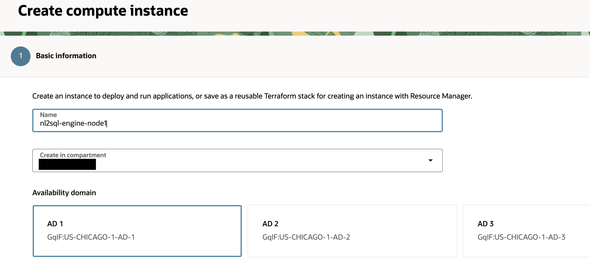

## VM1 - Engine

### VM Setup – Provision VM Instance

### Prerequisites 

This section assumes the following resources are configured: 
* [Policies & Dynamic Groups](./generic.md#dynamic-groups)
* [Business & Trust ADBs](./database.md)
* [OCI Cache Cluster](https://docs.oracle.com/en-us/iaas/Content/ocicache/createcluster.htm#top) 
* [VCN](https://docs.oracle.com/en-us/iaas/Content/Network/Tasks/quickstartnetworking.htm#Virtual_Networking_Quickstart)
    - Ingress rules are added to security list to allow traffic from public/private subnet on the following:
        - port 8000 & 8001 (nl2sql & trusthelper)
        - port 80 & 443 (http & https for API Gateway)
        - port 6379 (SL automatically generated upon OCI Cache Redis creation)
        - port 1521 (if using private db)

> **Note** There is a partial dependency on the VB apps in the configuration file; however you can proceed for now without the VB apps and return later to populate the VB app endpoints. 

#### Provision VM Instance

> **Note** The business vm (engine) is to be deployed on a private subnet. To access this instance, it's recommended to also create a jump host on the associated public subnet, and allow ssh access to the ingress on the private subnet. 

>**Note** It can be helpful to use a VS Code extension like 'SSH - Remote' to connect to your instance in your private subnet. This assumes you have an ssh config entry in your local .ssh/config file such as below: 

```
Host a2c-askdata-dev2-host
    HostName <private-engine-host-ip>
    User opc
    IdentityFile <path-to-engine-key>
    ProxyJump askdata-dev-jump

Host a2c-askdata-dev
    HostName <askdata-jump-public-ip>
    User opc
    IdentityFile <path-to-jump-host-key>
```

1.  Go Instances and Create the following Instance in the private subnet of VCN created above:

<br>


2.  Give a meaningful name:

<br>



3.  Pick an image – pick *Oracle Linux Cloud Developer 8*

<br>


<br>


<br>


4.  Adjust shape 2 or more oCPUs, 16GB or more RAM

> **Note**: oCPU = ~4 ECPUs 

<br>


5.  Add SSH key:

<br>


6.  Pick custom boot volume

<br>


7.  Finally Create the instance

### VM Setup – Configuring VM Instance

#### Configuring VM Instance

1.  Now start configuring the instance
2.  SSH into the box as opc user
3.  Adjust the boot volume size:

```
sudo lsblk
sudo parted /dev/sda print
sudo parted /dev/sda
resizepart 3 100%
quit

sudo pvresize /dev/sda3
sudo vgdisplay ocivolume
sudo lvextend -l +100%FREE /dev/ocivolume/root
sudo xfs_growfs /
```

4.  Switch python version:  
    `sudo update-alternatives --config python3`

Above command will display 2 options. Pick the option for python 3.11 (most probably you will be picking option 2)

> **Note** If not working, try installing python 3.11 manually (OL8.8 or later)

```bash
$ sudo dnf install python3.11
```

5.  Correct pip version:

``` bash
sudo dnf install python3.11-pip
sudo update-alternatives --install /usr/bin/pip pip /bin/pip3.11 40
which pip
pip --version
```

in the command above make sure pipe version is also 3.11

6.  Open Local Firewall

``` bash
sudo firewall-cmd --add-port=8000/tcp --permanent
sudo firewall-cmd --add-port=8001/tcp --permanent
sudo firewall-cmd --add-port=1521/tcp --permanent
sudo firewall-cmd --add-port=6379/tcp --permanent
sudo firewall-cmd --add-port=80/tcp --permanent
sudo systemctl restart firewalld
```

7.  Install python Libraries:

``` bash
sudo pip install spacy # - done
sudo pip install requests
sudo pip install redis
sudo pip install sqlalchemy
pip install --upgrade snowflake-sqlalchemy # -new one
sudo pip install pandas
sudo pip install fastapi # -- done
sudo pip install oracledb
sudo pip install seaborn matplotlib --upgrade
sudo pip install numpy
sudo pip install oci # - done
sudo pip install oracledb --upgrade
sudo pip install openpyxl
sudo pip install sql-metadata
sudo pip install ubicorn # -Not working (library doesnot exist)
sudo pip install uvicorn
sudo pip install --upgrade sqlalchemy
sudo pip install --upgrade oci
sudo pip install oracledb
sudo pip install oci --upgrade
sudo pip install oracledb --upgrade
sudo pip install oracledb --upgrade
sudo pip install faiss-cpu
sudo pip install sentence-transformers
sudo pip install 'uvicorn\[standard\]'
sudo pip install plotly
sudo pip install -U kaleido
sudo pip install sseclient
sudo pip install simplejson
# *(DONE)*
sudo pip install sseclient-py
```

8.  (Optional) Add user auth keys

- Make directory called “.oci “ under /home/opc
- cd .oci
- make file called “config”
add details from your auth key into config:

```
user=
fingerprint=
tenancy=
region=
key_file=
```

- under */home/opc/.oci*

add your pem file from auth key generation in oci console

> **Note**: Instance principal authentication has been recently added to the engine, which will execute if api key is not provided.

9.  Get Wallets
    1.  Wallet for ADW1 (solution/trust db)
    2.  Unzip into a directory under /home/opc
    3.  Wallet for ADW2 (business db)
    4.  Unzip into a directory under /home/opc (use different dir name from above)

10. Copy code on the box from the following folder in the source repo:


11. Enter custom values in Config.properties
    - You can also provide a secret ocid for your database password. See [Create Vault Secret](./vault.md#vault---secret) for creating a new secret for your database passwords. 
        - Create new secret for your client (business) database password 
            - Provide client (business) db secret ocid as database.password_secret under [DatabaseSection] 
        - Create new secret for your trust (solution) database password 
            - Provide trust (solution) db secret ocid as password_secret under [DEFAULT]

> **Note**: The code will first check if database password exists, then checks for database secret. Only one parameter (password or password secret) needs to be provided for each section (DatabaseSection and DEFAULT). 

> **Note**: If providing a secret, the secret should be in a vault in the same region as the rest of the application. Using a vault in a different region can cause connection issues. 

# Configuration File

## [Logging]
```
#DEBUG, INFO, WARNING, ERROR, CRITICAL
file.level=DEBUG
console.level=DEBUG
logs.path=./logs
```

## [FeatureFlags]
```
feature.dynamicprompt=true
feature.explain=false
feature.intent=false
feature.llmgraphcheck=false
feature.chatgraph=false
```

## [security]
```
anonymous.flag=true
```

## [DatabaseSection]
```
database.user=askdata_bi_user
database.password=xxxxxxxxx
database.password_secret=xxx
database.dsn=businessdb_low
database.config=/home/opc/askdata_bi
database.walletpsswd=xxxxxx
database.debug=Y
database.rbac=N
```

## [KeySection]
```
key.llm=notused
key.searchapi=notused
token=notused
```

## [RedisSection]
```
redis.url=rediss://redis-root.redis.us-chicago-1.oci.oraclecloud.com:6379
url=redis-root.redis.us-chicago-1.oci.oraclecloud.com
port=6379
```

## [GenAISQLGenerator]
```
sql.dialect=Oracle
#Scenario3
```

## [QueryResult]
```
max.resultset=50
filter.upn=notused
filter.ignoreup
```

## [vbcs]
```
# endpoint url should be the root e.g. endpoint.url=https://<your-vb>.oraclecloud.com/ic/builder/rt/
endpoint.url=<vbcs-endpoint-url>
# graph url should be relative to endpoint url e.g. <your-graph-app>/1.0/webApps/nl2sql_interactivegraph/
graph_app.url=<graph-app-url>
# table graph should also be relative
idata_app.url=<table-graph-url>
```

## [OCI]
```
#Sao Paulo
#serviceendpoint.url=https://inference.generativeai.<region>.oci.oraclecloud.com
#Scenario2
# DAC or DS or GAI
serviceendpoint.active=GAI
serviceendpoint.ds_endpt=<service-endpoint-url>
serviceendpoint.ds_model=<service-endpoint-ds-model>
serviceendpoint.url=https://inference.generativeai.us-chicago-1.oci.oraclecloud.com
serviceendpoint.ocid=<service-endpoint-ocid>
serviceendpoint.model=<service-endpoint-model>
serviceendpoint.dac_url=https://inference.generativeai.us-chicago-1.oci.oraclecloud.com
serviceendpoint.dac_ocid=<comp-ocid>
serviceendpoint.dac_endpt=<dac-endpoint-ocid>
serviceendpoint.model_embed=cohere.embed-english-v3.0
serviceendpoint.llm_name=notused
#serviceendpoint.llm_name=OCI-GenAI-LLAMA405bB
```

## [METADATA]
```
basepath=./metadata
default=metadata.sql
schema.ddl=metadata.sql
file.embdgs=notused
file.col_embdgs=notused
librarymatch.threshold=0.80
librarymatch.upperthreshold=1.0
```

## [SemanticMatch]
```
semantic.enabled=true
semantic.fetchlimit=5
semantic.additionalhint=Use ABS only when necessary.
semantic.scorethreshold=0.6
```

## [SemiTrustedPath]
```
semitrusted.enabled=true
semitrusted.fetchlimit=3
```

## [DEFAULT] # trust db connection
```
user=xxxxxx
password=xxxxx
dsn= xxxxx
wallet_location=xxxx
wallet_password=xxxxx
```

12. Place metadata file “metadata” folder

13. Test deployment 

Run 

```bash 
$ python3.11 nl2sql_app.py
``` 

to begin service on port 8000.

To run in backround: 

```bash
nohup python3.11 nl2sql_app.py &
nohup python3.11 trusthelper_ep.py &
```

### Test Service 

```
curl -d '{"question":"show total paybales amount", "sessionid" :"fjfjfjfjfjfdddj"}' -H "Content-Type: application/json" -X POST <http://localhost:8000/>
```

Console logs will be printed to nohup.out and can be redirected to a custom file at the startup.
Application logs will be redirected to <approot>/logs/nl2sql_app.log and <approot>/logs/trusthelper_ep.log.Additional details on logging:
Log files are stored in the <approot>/logs directory.
Logs are automatically rotated at service startup.
Logging behavior is configured via the ConfigFile.properties file located in the <approot> directory.

### Stop Service 

Run the following command to find the PID
ps -ef|grep nl2sql_app (OR) ps -ef|grep trusthelper_ep
The following command to kill/stop the service
kill -9 <pid>


## Installing to new VM

## sample ssh commands

used to log into the NL2SQL Engine (VM-1)

### private vm (using jump host)

`sudo ssh -f -N -i ~/.ssh/ssh-key.key -L 22:10.x.x.xxx:22 opc@207.xxx.xxx.xx\`

`ssh -i ~/.ssh/ssh-key.key opc@localhost\`

### public vm

`ssh -i ~/.ssh/ssh-key.key opc@207.xxx.xxx.xxx\`

### clean up ssh to reuse localhost

`ps aux \| grep ssh`

`kill {pid}`

- pid should be the process ID for the ssh localhost tunnel found in the ps command above

`$EDITOR /Users/my-user/.ssh/known_hosts`

- remove last entries to reuse localhost

## [Return home](../../../README.md)