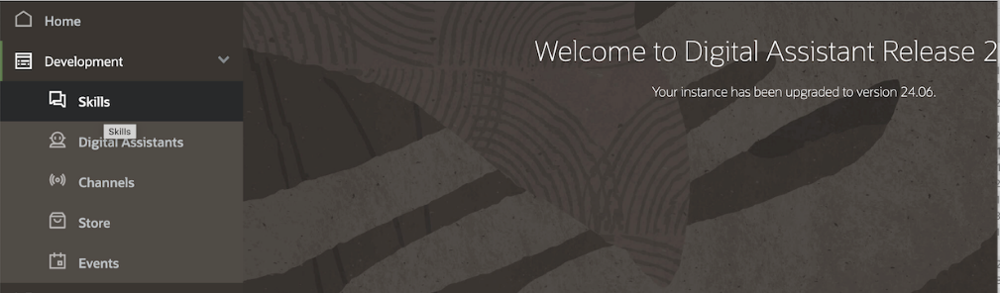
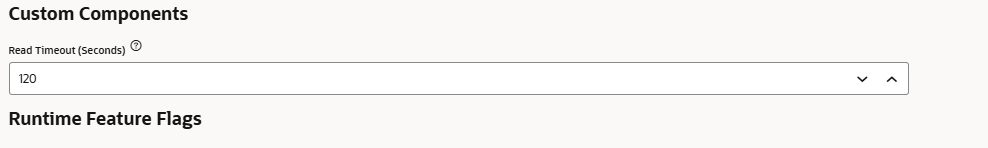

## Oracle Digital Assistant (ODA)

### ODA Setup – Provision ODA Instance

### Prerequisites 

This section assumes the following resources are configured: 
* [IDCS Application](./business_idcs.md)
* [Engine Application](./nl2sql_engine.md)
* [API Gateway](./business_api_gateway.md)

#### Provision ODA Instance

1. Sign in to your Oracle Cloud account.

2. In the Infrastructure Console,
    click on the top left to open the navigation menu, select **Analytics & AI**,
    and select **Digital Assistant** (which appears under the **AI Services** category on the page).

3. From the **Compartments** panel, select a compartment.
4. Click **Create Digital Assistant Instance**.
5. On the **Create Digital Assistant Instance** page, fill in the following details:
    - **Compartment**. 
    - **Name**. Enter a name that reflects usage of the instance. For
      example, for a development environment, genai-nl2sql-dev
    - **Instance shape**. Select between the following shapes:
      - **Development**. This is a lightweight option that is geared
        toward development work.
      - **Production**. This option should be selected for production
        instances of Digital Assistant. In comparison with the
        Development shape, this option has higher rate limits and
        greater database capacity, which enables more Insights data to
        be collected.


6. Click **Create**.

7. After a few minutes, your instance will go from the status
    of Creating to Active, meaning that your instance is ready to use.

### Deploy ODA Code – REST APIs

#### Import REST APIs

1. Sign in to your ODA console.

    - Next click on “settings” as shown below


- Click on API Services -\> REST Services -\> Import REST Services


##### Import the following REST services under nl2sql-main/vbcs_oda_archives/oda:


- After import, for each of them, point them to api gateway url (do not
  change the trailing part of the URL like /v1/prompt in the example below)


#### Select the location of API Gateway url


### Deploy ODA Code – Authentication Service

#### Create Authentication Service

1. Sign in to your ODA console.

2. Next click on “settings” as shown below


- Select Authentication Services from the list. Add new authentication service


- Give IDCS URLs below

#### To find the hostname for the Domain in the IDCS URL


```
Grant Type: Authorization Code
Identity Provider: Oracle Identity Cloud Services
Token Endpoint URL: \<IDCS base url\>/oauth2/v1/token
Authorization Endpoint URL: \<IDCS base url\>/oauth2/v1/authorize

Client ID: \<Client Id from the IDCS confidential app\>
Client Secret: \<Client Secret from the confidential app\>

Scopes: urn:opc:idm:__myscopes__

Subject Claims: sub

Refresh Token Retention Period: 7
```

> **Note** If your idcs app is using a custom scope, use that scope instead e.g. odatest

- Provide Client ID of IDCS & secret from IDCS confidential app below


> **Note** The scope will be the audience + scope defined in [Deploy IDCS Application](./business_idcs.md#adding-scopes) e.g. odatest

### Deploy ODA Code – Skill

#### Import ODA Skill

1. Sign in to your ODA console.

    - Click Development -\> Skills




2. Click “Import Skill” (located right top corner):


3. Zip and Import the skill provided in nl2sql-main/vbcs_oda_archives/oda/askdata-oda-base folder in the code:

> **Note** The skills *oda-skill-EmbeddedCont* & *oda-skill-ExtOracleFn* are provided as a reference, in case you'd like to deploy the custom componet as an oracle function. If you would like to deploy the component as a function, see [Deploy Function Application](../deployment/function.md).

For these instructions we'll be using the askdata-oda-base skill.

- Navigate to [askdata-oda-base directory](../../../vbcs_oda_archives/oda/askdata-oda-base/)

- Run the following 

```bash
zip -r genaisqlskill.zip .
```

- In ODA, navigate to Development > Skills > Import Skill

- Upload zipped skill


- After the skill is imported, you should see following under the list
  of skills: (actual name may differ)


- Next Navigate your Skill


- Go back to your skill and Train


### Update ODA Skill

#### Update REST API URL in the Custom Component

1.  Sign in to your ODA console.

    - Click Development -\> Skills
    - Open skill
    - Go to Skill’s Settings


- Under Configuration tab 🡪 Custom Parameters 🡪 Edit postQueryURL


>
> Replace URL
>


>
> This will be the APIGW URL
>
> example:
> <https://api-host.apigateway.us-chicago-1.oci.customer-oci.com/v1/prompt>

#### Confirm queryBackendService Custom Component is Deployed

1. Navigate to custom components and check to see if the custom component is deployed 


2. If the custom component failed to deploy, navigate to [queryBackendSvc](../../../vbcs_oda_archives/oda/queryBackendSvc/) under /vbcs_oda_archives/oda and run 

```bash 
bots-node-sdk pack
```

> **Note** If bots-node-sdk is not installed on your machine, run the following:

```bash
    npm install -g @oracle/bots-node-sdk
```

Once packed select the pencil icon and upload the new package just created to redeploy the component. 

For further instructions on installing, see [bots-node-sdk](https://github.com/oracle/bots-node-sdk)

#### Update Read Timeout for the Custom Component

1. Sign in to your ODA console.
    - Click Development -\> Skills
    - Open skill
    - Go to Skill’s Settings 🡪 General tab



> Increase this value if a response from the backend system is expected
> to be longer than the specified value.

### Deploy ODA Code – Channel

#### Create ODA Channel

1. Sign in to your ODA console.

2. Create a Channel for your Skill


>

>


- Make sure to enter “\*” for allowed domains if you would like to be accessible from anywhere.
- Make sure to note down channel id above.
- Also note on the main OCI page for ODA the base web url


>
> Or
>


- Finally configure the Channel to use the published Skill:


>
>


### Pay attention on Channel Creation
- **Make sure to enable the channel upon creation. It is disabled by default.**

- **Also make sure “Client Authentication Enabled” is disabled. It is enabled by default.**


### Update Confidential App

#### Update Redirect URL

> Go back to Confidential App to replace the Redirect URL value with ODA base url concatenated with connector string.
>
> Format:
> To find ODA url
>

>


## Application Customization

> **Note** This section is optional.

### Edit ODA Skill

#### Customize Greetings

To customize initial greeting message-


> Open ODA Skill

Select Flow Designer 🡪 greetingsFlow


Open component, Greetings


Edit the messages field.

#### Customize Domain areas

To customize the following list -


Open ODA Skill

Select Entities 🡪 Modules


Add new values and delete existing values


#### Update Routing & example prompts

To update the routing rules & example prompts-


Edit each of the highlighted send message components.


Edit Switch Activity to update routing


🡪🡪 

**Remember to retrain the skill**


## [Return home](../../../README.md)