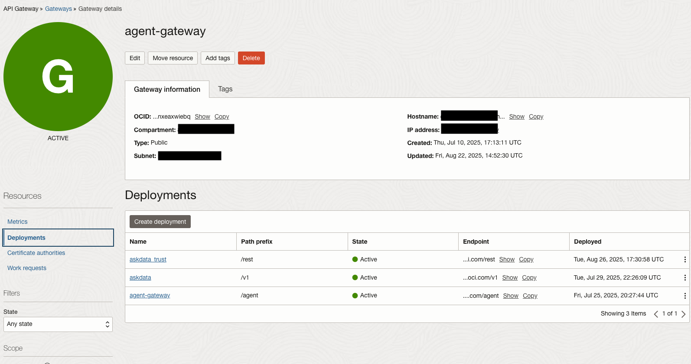
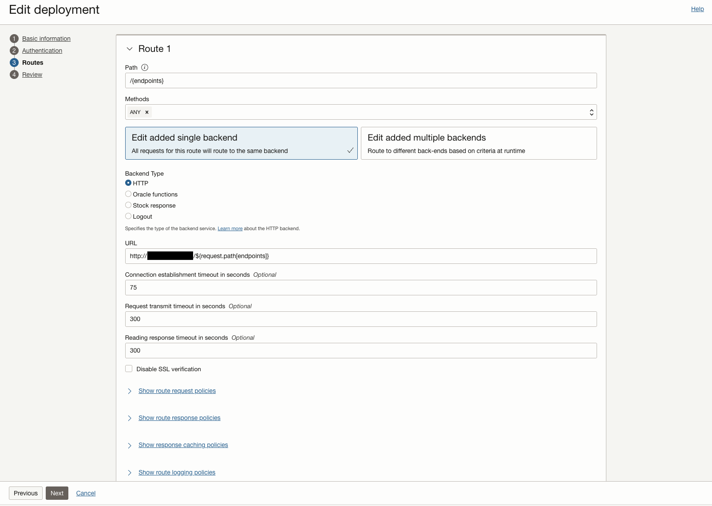
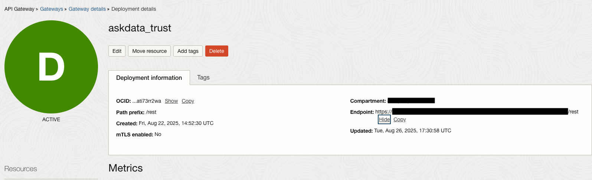

# Trust API Gateway 

## Introduction 

This document will review creating an API Gateway deployment for the Trust Application. This configuration can be used on the same API Gateway configured for the business app, but it will use a new deployment. 

## Prerequisites 

This page assumes the following resources are running: 

- [Trust VM](../deployment/trust-service.c.md)
- [API Gateway](../deployment/business_api_gateway.md)
    
**NOTE** This assumes your business API Gateway is in the same VCN as your Trust Application resources. If not, you will need to create a new API gateway in the VCN with the trust application. 

## Configuration 

1. Navigate to the API Gateway created for your business app. 

2. Go to deployments and create a new deployment 

3. Give the deployment a name e.g. `askdata_trust` and a path prefix e.g. `/rest`

4. Select Next > select Single Authentication 

 - 4.1 Follow the steps in [Business API Gateway](../deployment/business_api_gateway.md), but instead of using the business IDCS app, use the new IDCS Application for your APEX application as configured in [Configure APEX Trust Step 3.4](../deployment/apex-trust.md#step-34-configure-idcs-and-apex) and [APEX Identity Domains](https://docs.oracle.com/en/learn/apex-identitydomains-sso/index.html#introduction). 

 > **NOTE** Make sure the APEX IDCS app has Client Credentials enabled and Allowed operations set to Introspect

5. In routes, specify the following: 
    - Under path specify the literal value `/{endpoints}`
    - In URL specify http://trust-ip:8000/${request.path[endpoints]}
    - Set connection establishment timeout to 75
    - Set request and response timeout to 300

6. Leave the rest as default, review and create the deployment. 

7. Make a note of the endpoint for the deployment once configured. This will be used as the backend REST service to your APEX application as illustrated in [Configure APEX](../deployment/apex-trust.md#step-2-update-value-of-rest_api-property-to-the-proper-endpoint-and-click-apply-changes)

