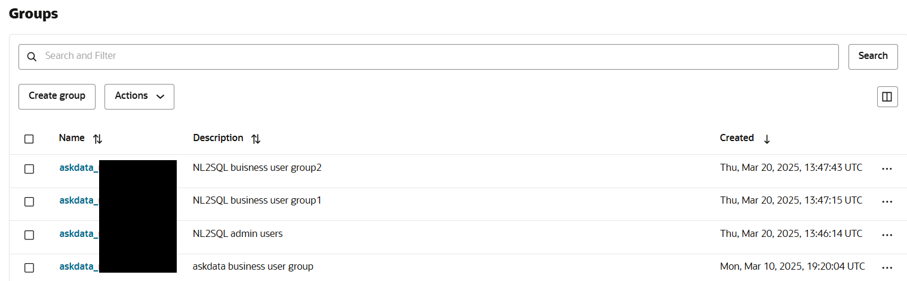
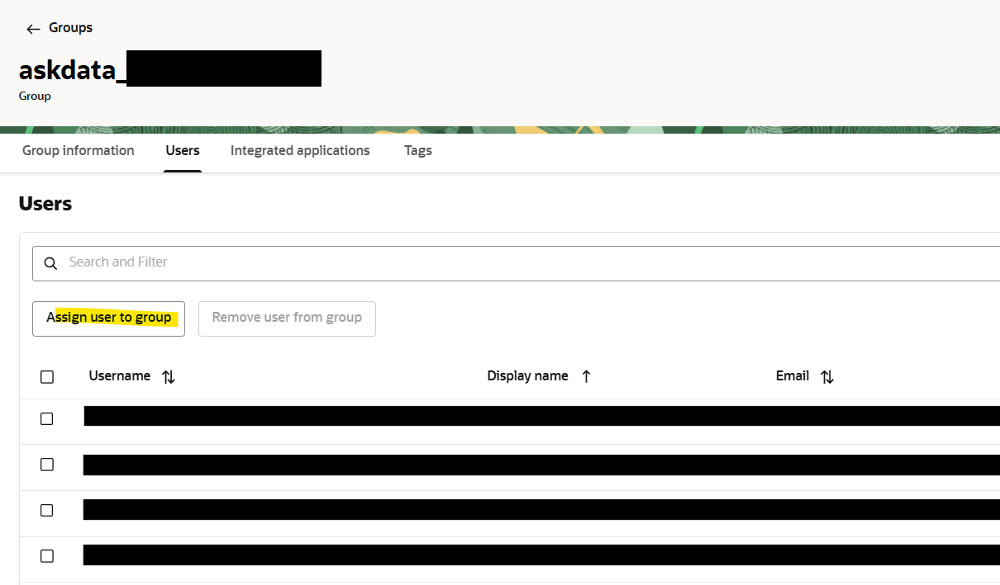

# Validation

## Get oAuth Token from IDCS

### oAuth Token Validation from IDCS

| cURL Command |
|--------------|
| `curl -X POST "https://<idcs url>/oauth2/v1/token" -H "Content-Type: application/x-www-form-urlencoded" -d "client_id=<client_id>" -d "client_secret=<client_secret>" -d "grant_type=client_credentials" -d "scope=urn:opc:idm:__myscopes__"` |
| |
| **Example:** |
| |
| `curl -X POST "https://idcs-server.identity.oraclecloud.com/oauth2/v1/token" -H "Content-Type: application/x-www-form-urlencoded" -d "client_id=clientId" -d "client_secret=clientSecret" -d "grant_type=client_credentials" -d "scope=urn:opc:idm:__myscopes__"` |


Example Response:

```
{

 "access_token":
 "xyz",
     "token_type": "Bearer",
 "expires_in": 3600
}
```

### LLM Prompt Validation

Note that the Bearer token is the same as above.

| cURL Command |
|--------------|
| `curl -X POST "https://<apigw url>/v1/prompt" -H "Content-Type: application/json" -H "Authorization: Bearer <token>" -d "{\"question\" : \"Show invoices amount\", \"sessionid\": \"9876543210161\", \"userName\" : \"john.doe@example.com\", \"domain\" : \"Payables\"}"` |
| |
| **Example:** |
| |
| `curl -X POST "https://apigw-host.apigateway.us-chicago-1.oci.customer-oci.com/v1/prompt" -H "Content-Type: application/json" -H "Authorization: Bearer xyz" -d "{\"question\" : \"Show invoices amount\", \"sessionid\": \"9876543210161\", \"userName\" : \"john.doe@example.com\", \"domain\" : \"Payables\"}"` |


Response:

Sample:

"User request was not processed, please check your access."

### Feedback Up Down

| cURL Command |
|--------------|
| `curl -X POST "https://<apigw_url>/v1/feedbackupdown" -H "Content-Type: application/json" -H "Authorization: Bearer <token>" -d "{\"feedbackcode\" : \"1\", \"sessionid\": \"9876543210161\"}"`   |
| |
| **Example:** |
| |
| `curl -X POST "https://apigw-host.apigateway.us-chicago-1.oci.customer-oci.com/v1/feedbackupdown" -H "Content-Type: application/json" -H "Authorization: Bearer xyz" -d "{\"feedbackcode\" : \"1\", \"sessionid\": \"9876543210161\"}" |


Response:

“Done”

### Feedback Message

| cURL Command |
|--------------|
| `curl -X POST "https://<apigw_url>/v1/feedbackmessage" -H "Content-Type: application/json" -H "Authorization: Bearer <token>" -d "{\"feedback\" : \"it did not work\", \"sessionid\": \"9876543210161\"}"` |
| |
| **Example:** |
| |
| `curl -X POST "https://apigw-host.apigateway.us-chicago-1.oci.customer-oci.com/v1/feedbackmessage" -H "Content-Type: application/json" -H "Authorization: Bearer xyz
|

Response:

“Done”

### getsql on NL2SQL Engine

POST http://<backend vm ipaddress>/getsql

`curl -X POST "http://<backend_vm_ipaddress>/getsql" -H "Content-Type: application/json" -d "{\"question\":\"Show invoices with amount due\"}"`
<br>
[Example: http://207.xxx.xxx.xx:8002/getsql](http://207.xxx.xxx.xx:8002/getsql)

`curl -X POST "http://207.xxx.xxx.xx:8002/getsql" -H "Content-Type: application/json" -d "{\"question\":\"Show invoices with amount due\"}"`

Response: Look for 200 OK


### getdata on NL2SQL Engine

GET http://<backend vm ipaddress>/getdata/?idataId=<random value>  

[Example: http://207.xxx.xxx.xx:8000/getdata/?idataId=abc](http://207.xxx.xxx.xx:8000/getdata/?idataId=abc)  

`curl -X GET "http://207.xxx.xxx.xx:8000/getdata/?idataId=abc" -H "Content-Type: application/json"`

Response:  { "message": "No data found" }

### igraph

GET https://<apigw url>/igraph/?graphId=<random value>
[Example: https://apigw-host.apigateway.us-chicago-1.oci.customer-oci.com/v1/igraph/?graphId=abc](https://apigw-host.apigateway.us-chicago-1.oci.customer-oci.com/v1/igraph/?graphId=abc)

Response:  
|  |
|--|
| { "data": [], "layout": { "template": { "data": { "histogram2dcontour": [ { "type": "histogram2dcontour", "colorbar": { "outlinewidth": 0, "ticks": "" },… |


### getprompt on NL2SQL Engine

POST http://<backend vm ipaddress>/getprompt
`curl -X POST "http://<backend_vm_ipaddress>/getprompt" -H "Content-Type: application/json" -d "{\"question\":\"show invoices with amount due of type CREDIT\"}"`

[Example: http://207.xxx.xxx.xx:8002/getprompt](http://207.xxx.xxx.xx:8002/getprompt) 

`curl -X POST "http:// 207.xxx.xxx.xx:8002/getprompt" -H "Content-Type: application/json" -d "{\"question\":\"show invoices with amount due of type CREDIT\"}"`

Response: Look for 200 OK

# Management

## Backend Server

### Start

> The NL2SQL application is supported by two backend services:

1.  **nl2sql_app.py** – Runs on port **8000**

2.  **trusthelper_ep.py** – Runs on port **8002**

Both services are located in the \<approot\> directory and can be started using nohup to run in the background.

```
  cd <approot>  
  nohup python nl2sql_app.py &  
  nohup python trusthelper_ep.py &
```


Console logs will be printed to nohup.out and can be redirected to a custom file at the startup.  
Application logs will be redirected to \<approot\>/logs/nl2sql_app.log and \<approot\>/logs/trusthelper_ep.log.**Additional details on logging:**  
Log files are stored in the \<approot\>/logs directory.  
Logs are **automatically rotated** at service startup.  
Logging behavior is configured via the ConfigFile.properties file
located in the \<approot\> directory.

| [Logging]  
# Available levels: DEBUG, INFO, WARNING, ERROR, CRITICAL  
file.level=DEBUG  
console.level=DEBUG  
logs.path=./logs |


#### Stop

Run the following command to find the PID
`ps -ef | grep nl2sql_app (OR) ps -ef | grep trusthelper_ep`

The following command to kill/stop the service
`kill -9 <pid>`

## End-user Access to VBCS Application

### Application Access

#### Add user

1.  Sign in to your Oracle Cloud account as an administrator.
2.  In Oracle Cloud Infrastructure Console, navigate to **Identity & Security**, and click **Domains**.
3.  Select \<Domain\>
4.  Click the name of the identity domain, and click **User management**.
5.  Select appropriate group depending upon the type of access needed

  
6.  Add user to the group
    
  