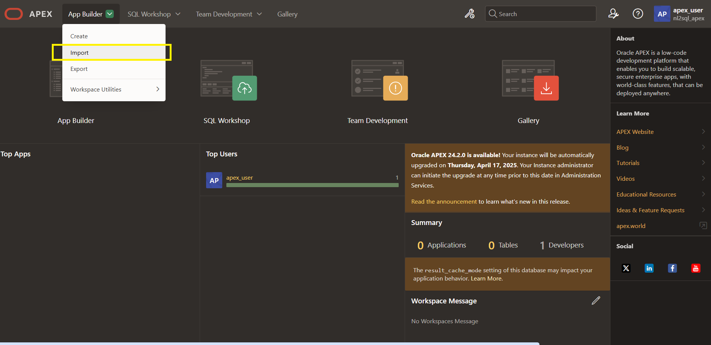
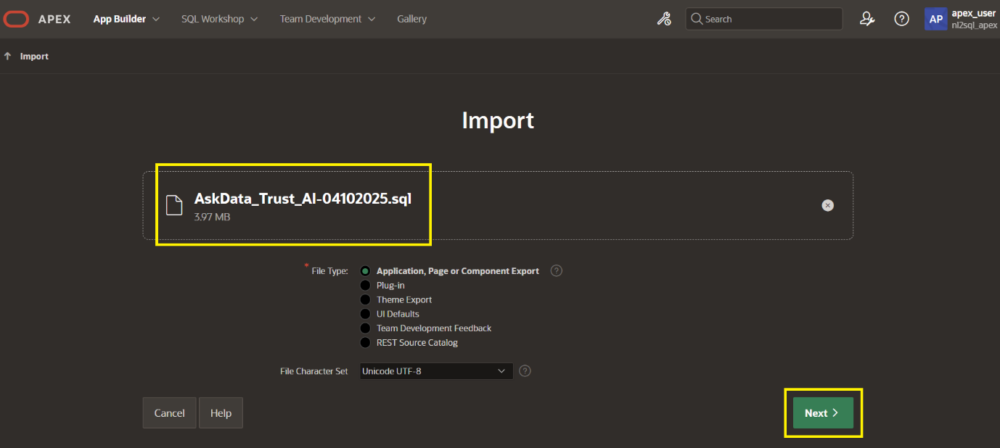
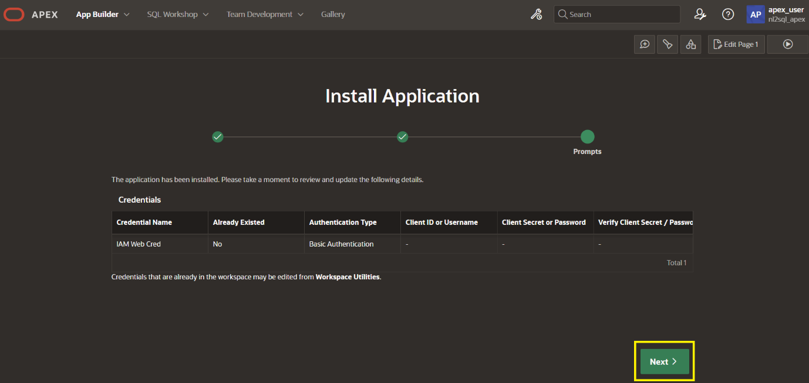
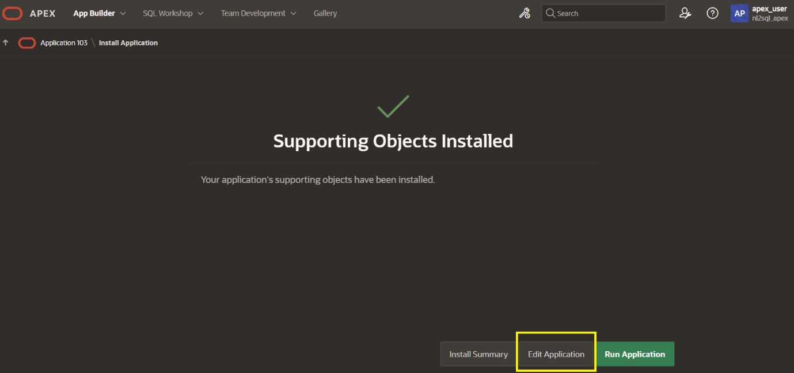
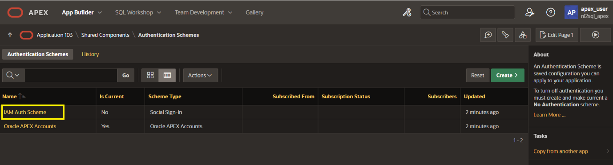
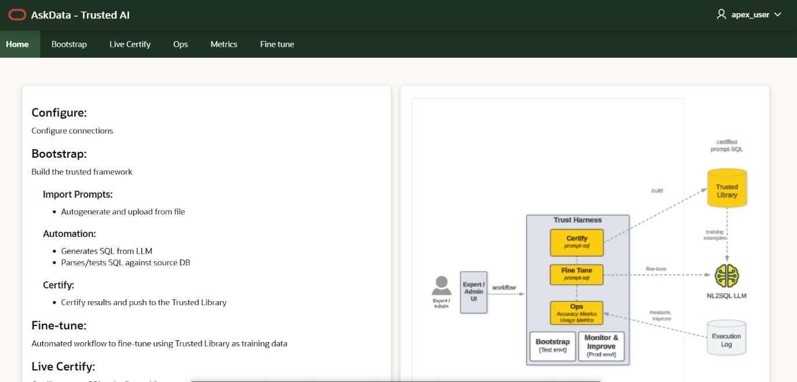
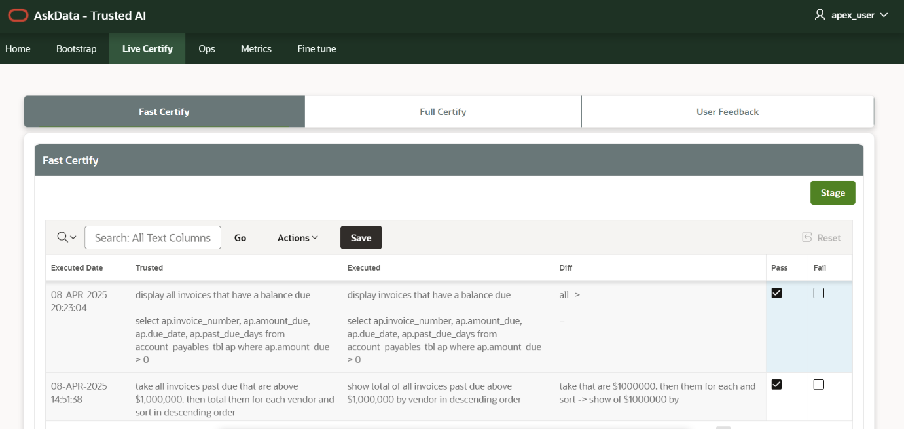

# AskData - Trusted AI

## Import APEX application

### Step 1. Select Import

### Step 2: Download the latest APEX export

Select the file(AskData_Trust_AI-\<mmddyyyy\>.sql) from the artifact registry.

### Step 2.1 Upload this latest export file here and click Next.

### Step 3: Verify all the details and click Install Application.

### Step 4: Click Next

### Step 5: Click Install Supporting Objects

### Step 6: Click Edit Application after succesfull installation.

## Configure APEX application:

### Step 1: Click Edit Application Definition from the application home page.

### Step 2: Update value of REST_API property to the proper endpoint and click Apply Changes.
The REST API is the URL for the trust API gateway.

### Step 3: IDCS SSO Integration

If the application needs IDCS SSO integration, then follow next steps. Otherwise proceed to run application.

#### Step 3.1 : Click Shared Components from application home page.

#### Step 3.2: Click on Authentication Schemes under Security section.

#### Step 3.3: Click on IAM Auth Scheme.

#### Step 3.4: Configure IDCS and APEX

Follow the below link to configure IDCS + APEX integration and
update the values on both sides accordingly. Then click on Make Current Scheme.

<https://docs.oracle.com/en/learn/apex-identitydomains-sso/index.html#introduction>

## Run APEX application:

### Step 1: Click on run button.

### Step 2: The home page looks like below after login.

### Step 3: Verify Live Certify page to check whether the REST endpoint is functioning as expected.

