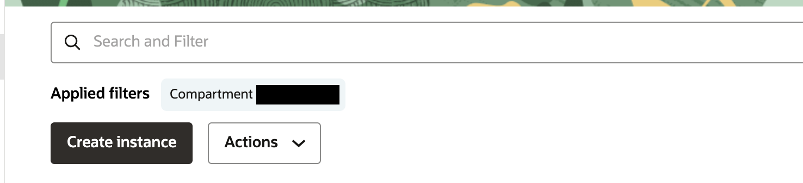
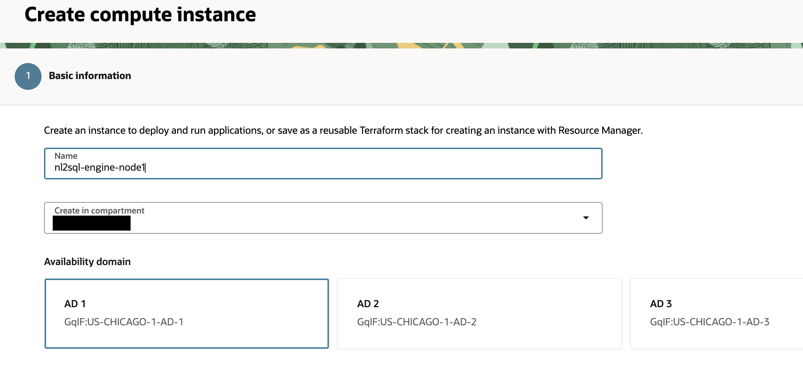
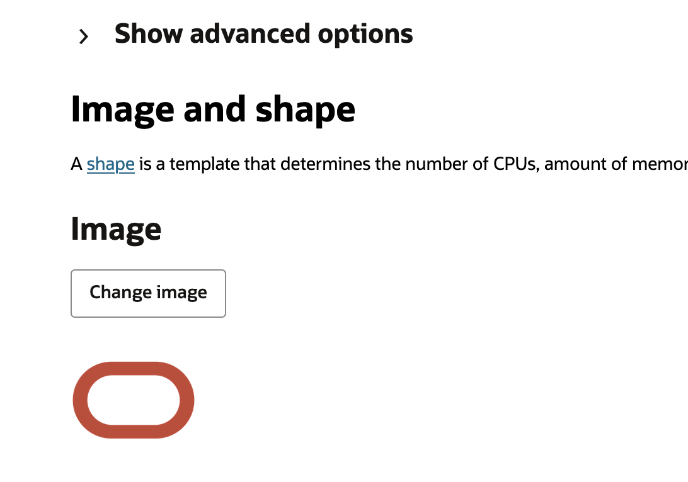
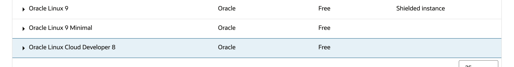
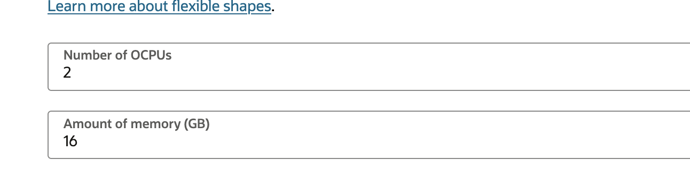
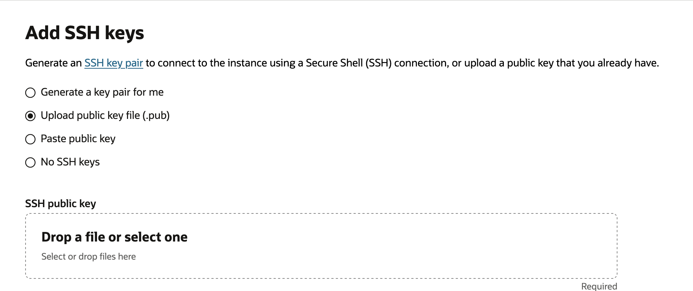
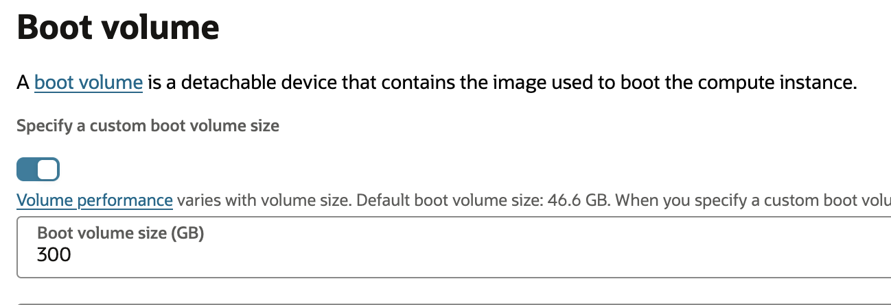

## VM1 - Engine

### VM Setup – Provision VM Instance

#### Provision VM Instance

1.  Go Instances and Create Instance:

<br>



2.  Give a meaningful name:

<br>



3.  Pick an image – pick *Oracle Linux Cloud Developer 8*

<br>



<br>


<br>



4.  Adjust shape 2 or more oCPUs, 16GB or more RAM

<br>



5.  Add SSH key:

<br>



6.  Pick custom boot volume

<br>



7.  Finally Create the instance

### VM Setup – Configuring VM Instance

#### Configuring VM Instance

1.  Now start configuring the instance
2.  SSH into the box as opc user
3.  Adjust the boot volume size:

```
sudo lsblk
sudo parted /dev/sda print
sudo parted /dev/sda
resizepart 3 100%
quit

sudo pvresize /dev/sda3
sudo vgdisplay ocivolume
sudo lvextend -l +100%FREE /dev/ocivolume/root
sudo xfs_growfs /
```

4.  Switch python version:  
    `sudo update-alternatives --config python3`

Above command will display 2 options. Pick the option for python 3.11 (most probably you will be picking option 2)

5.  Correct pip version:

``` bash
sudo dnf install python3.11-pip
sudo update-alternatives --install /usr/bin/pip pip /bin/pip3.11 40
which pip
pip --version
```

in the command above make sure pipe version is also 3.11

6.  Open Local Firewall

``` bash
sudo firewall-cmd --add-port=8000/tcp --permanent
sudo firewall-cmd --add-port=1521/tcp --permanent
sudo firewall-cmd --add-port=6379/tcp --permanent
sudo firewall-cmd --add-port=8001/tcp --permanent
sudo firewall-cmd --add-port=8001/tcp --permanent
sudo firewall-cmd --add-port=8002/tcp --permanent
sudo firewall-cmd --add-port=8003/tcp --permanent
sudo firewall-cmd --add-port=80/tcp --permanent
sudo systemctl restart firewalld
```

7.  Install python Libraries:

``` bash
sudo pip install spacy # - done
sudo pip install requests
sudo pip install redis
sudo pip install sqlalchemy
pip install --upgrade snowflake-sqlalchemy # -new one
sudo pip install pandas
sudo pip install fastapi # -- done
sudo pip install oracledb
sudo pip install seaborn matplotlib --upgrade
sudo pip install numpy
sudo pip install oci # - done
sudo pip install oracledb --upgrade
sudo pip install openpyxl
sudo pip install sql-metadata
sudo pip install ubicorn # -Not working (library doesnot exist)
sudo pip install uvicorn
sudo pip install --upgrade sqlalchemy
sudo pip install --upgrade oci
sudo pip install oracledb
sudo pip install oci --upgrade
sudo pip install oracledb --upgrade
sudo pip install oracledb --upgrade
sudo pip install faiss-cpu
sudo pip install sentence-transformers
sudo pip install 'uvicorn\[standard\]'
sudo pip install plotly
sudo pip install -U kaleido
sudo pip install sseclient
sudo pip install simplejson
# *(DONE)*
sudo pip install sseclient-py
```

8.  Add user auth keys

- Make directory called “.oci “ under /home/opc
- cd .oci
- make file called “config”
add details from your auth key into config:

```
user=
fingerprint=
tenancy=
region=
key_file=
```

- under */home/opc/.oci*

add your pem file from auth key generation in oci console

```
curl -d '{"question":"show total paybales amount", "sessionid" :"fjfjfjfjfjfdddj"}' -H "Content-Type: application/json" -X POST <http://localhost:8000/>
```

9.  Get Wallets
    1.  Wallet for ADW1 (solution db)
    2.  Unzip into a directory under /home/opc
    3.  Wallet for ADW2 (business db)
    4.  Unzip into a directory under /home/opc (use different dir name from above)

10. Copy code on the box from the following folder in the source repo:


11. Enter custom values in Config.properties

# Configuration File

## [Logging]
```
#DEBUG, INFO, WARNING, ERROR, CRITICAL
file.level=DEBUG
console.level=DEBUG
logs.path=./logs
```

## [security]
```
anonymous.flag=true
```

## [DatabaseSection]
```
database.user=askdata_bi_user
database.password=xxxxxxxxx
database.dsn=businessdb_low
database.config=/home/opc/askdata_bi
database.walletpsswd=xxxxxx
database.debug=Y
database.rbac=N
```

## [KeySection]
```
key.llm=notused
key.searchapi=notused
token=notused
```

## [RedisSection]
```
redis.url=rediss://redis-root.redis.us-chicago-1.oci.oraclecloud.com:6379
url=redis-root.redis.us-chicago-1.oci.oraclecloud.com
port=6379
```

## [GenAISQLGenerator]
```
sql.dialect=Oracle
#Scenario3
```

## [QueryResult]
```
max.resultset=50
filter.upn=notused
filter.ignoreup
```

12. Place metadata file “metadata” folder

test

```curl -d '{"question":"show total paybales amount", "sessionid" : "fjfjfjfjfjfdddj"}' -H "Content-Type: application/json" -X POST <http://localhost:8000/>```

13. Setting up semantic suggest autoprompt websocket

 - TBD (To be deprecated)

## installing to new vm

## sample ssh commands

used to log into the NL2SQL Engine (VM-1)

### private vm

`sudo ssh -f -N -i ~/.ssh/ssh-key.key -L 22:10.x.x.xxx:22 opc@207.xxx.xxx.xx\`

`ssh -i ~/.ssh/ssh-key.key opc@localhost\`

### public vm

`ssh -i ~/.ssh/ssh-key.key opc@207.xxx.xxx.xxx\`

### clean up ssh to reuse localhost

`ps aux \| grep ssh`

`kill {pid}`

- pid should be the process ID for the ssh localhost tunnel found in the ps command above

`$EDITOR /Users/my-user/.ssh/known_hosts`

- remove last entries to reuse localhost

## setup server for websocket connections

The commands in this section need to be run as the "root" user. If you
are not the "root" user, add "sudo " in front of every command to run
then from your admin user.

### Enable the EPEL repository
If you want to use the Oracle Linux repository for this, issue the following command.

``` bash
cd /tmp
wget https://dl.fedoraproject.org/pub/epel/epel-release-latest-8.noarch.rpm
sudo dnf install -y oracle-epel-release-el8
```

### 2. install snap

``` bash
sudo dnf install -y snapd
sudo systemctl enable --now snapd.socket
sudo systemctl start snapd
sudo ln -s /var/lib/snapd/snap /snap
getenforce
sudo setenforce 0
getenforce
sudo systemctl restart snapd snapd.socket
sudo snap install core
sudo snap refresh core
```

## (optional) setup certbot commands

### 1. install certbot and create cert

``` bash
sudo snap install --classic certbot
sudo ln -s /snap/bin/certbot /usr/bin/certbot
sudo /usr/bin/certbot certonly --standalone -d \<domain\>
```

- domain example: \`207.xxx.xxx.xxx.sslip.io\`
- no email address (enter)
- agree to terms of service (y)

sample response

``` markdown

Successfully received certificate.

Certificate is saved at: /etc/letsencrypt/live/207.xxx.xxx.xxx.sslip.io/fullchain.pem

Key is saved at: /etc/letsencrypt/live/207.xxx.xxx.xxx.sslip.io/privkey.pem

This certificate expires on 2025-05-05.

```

### 2. move certs

TODO: do we need to move folders or can the script access the certs
where they are originally made

```bash

mkdir /home/opc/cert
cd /home/opc/cert
sudo cp -r /etc/letsencrypt .
sudo chown -R opc:opc letsencrypt

```

- If you are planning on using the db_conn connection type, you will
additionally need to follow the optional steps to setup the db files
(wallet dir, ConfigFile.properties, connect_vector_db.py)

### (optional) setup db files if needed

TODO: resolve issue of duplicated files

If you are planning on using the db_conn connection type, you will need
to copy over some of the files/configuration from the parent ClientApp
directory to the autoprompt directory. Before doing this, make sure you
followed the instructions to setup the wallet and ConfigFile.properties
files.

ssh into vm

## check python dependencies

`pip freeze | grep -E 'fastapi |uvicorn |faiss-cpu |sentence-transformers |spacy |en_core_web_sm'`

### install instructions

`pip install fastapi uvicorn faiss-cpu sentence-transformers spacy`
`python -m spacy download en_core_web_sm`

## check port is open

By default, the websocket uses port 8002. This can be changed in the
config as described below. However the server's firewall (and vcn
security rules) must allow the port traffic

`sudo firewall-cmd --query-port=\<port_number\>/tcp`

### open port

```bash

sudo firewall-cmd --add-port=\<port_number\>/tcp --permanent
sudo systemctl restart firewalld

```

### Identity Domain

identity_domain must be supplied with the secrets of the confidential
app you made earlier for visual builder or disabled

- domain_url refers to just the unique portion of the url endpoint for your domain.
- This can be found on the domain overview page -\> domain information
- > Domain URL: https://idcs-********.identity.oraclecloud.com:443
- `domain_url = idcs-********`
- app_id, client_id, and secret_id can be found on the specific confidential application’s Oauth configuration page
- app_id is required to validate users
- client_id and secret_id are optional and just used to test token validation.

### Database

database must specify the database to go against

- fastapi
- recommended
- need to update url to trust’s service fastapi REST service
- db_conn
- currently needs duplicate versions of ConfigFile.properties, connect_vector_db.py, and wallet folder to work properly

### SSL

If you configure SSL earlier, you need to enable it and provide the path to the respective cert and key files

### websocket

Here is where you can specify the port for the websocket to use

## generate an oAuth token

only required if identity domain is enabled in config.ini

``` bash

client_id="your_client_id"
client_secret="your_client_secret"
combined="$client_id:$client_secret"
encoded=$(echo -n "$combined" | base64)

curl --location 'https://idcs-server.identity.oraclecloud.com/oauth2/v1/token' \
--header "Authorization: Basic \$encoded" \
--header 'Content-Type: application/x-www-form-urlencoded' \
--data-urlencode 'grant_type=client_credentials' \
--data-urlencode 'scope=urn:opc:idm:__myscopes__'

```

- Note: Only valid for one hour

## Test from wscat

### install wscat

```bash
sudo yum install -y nodejs npm
sudo npm install -g wscat

```

### test from wscat

```bash

/usr/local/lib/node_modules/wscat/bin/wscat -c wss://\<hostname or ip\>:\<port\>/wss/suggestions?token={token}

/usr/local/lib/node_modules/wscat/bin/wscat -c wss://localhost:8002/wss/suggestions?token=xyz

```

### test from postman

setup tunnel if connecting to a private vm

`sudo ssh -f -N -i ~/.ssh/ssh-key.key -L8002:10.x.x.xxx:8002 opc@207.xxx.xxx.xx`

in postman app -> new -> websocket

url format: wss://\<hostname or pi\>:\<port\>/wss/suggestions

under parameters:

- key: token
- value: auth token generated from above
