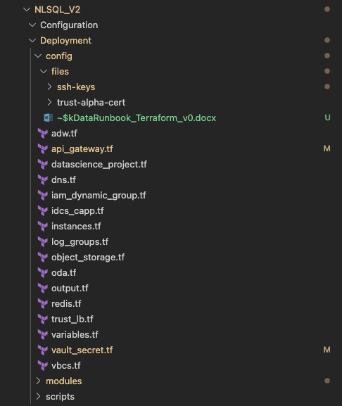
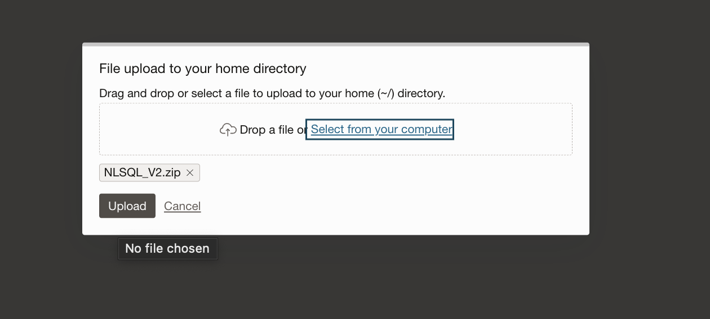
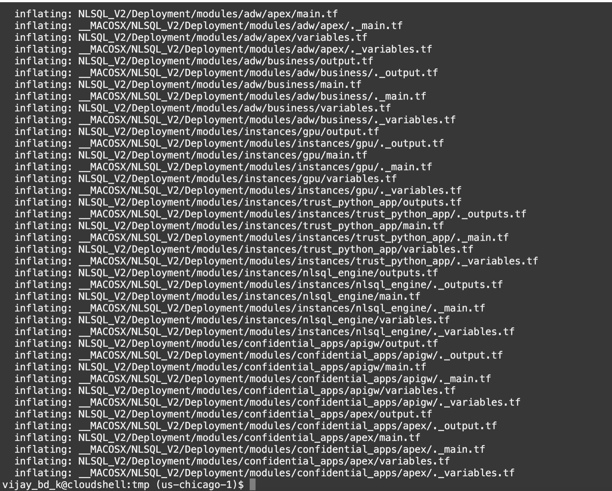
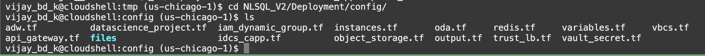
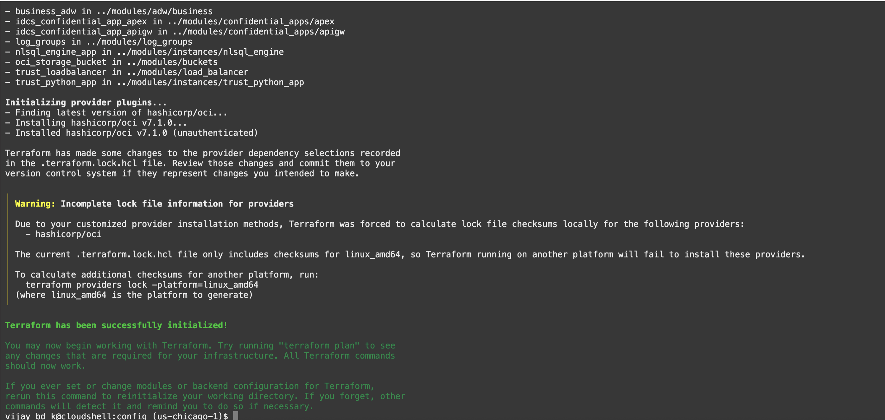

# Terraform Scripting

## Summary

This chapter provides instructions for deploying OCI CIS 2.0 Landing Zone with OCI Stacks and deploying Ask Data components using terraform.

## Overview

The following services are deployed as part of the solution, the components are distributed based on whether these are deployed with the LZ Stack or by custom TF Code.

### Landing Zone Components

    1.  Network Compartment
    2.  Security Compartment
    3.  App Compartment
    4.  Database Compartment
    5.  VCN
    6.  Subnets
    7.  DRG
    8.  Internet Gateway
    9.  Service Gateway
    10. IAM Dynamic Groups
    11. IAM Groups
    12. IAM Policies
    13. Alarms, Events, Topics and Notifications
    14. Vault
    15. Object Storage

### Custom Terraform Components

    1.  Business ADW
    2.  Trust/APEX ADW
    3.  Business API GW
    4.  Trust API GW
    5.  Object Storage Bucket
    6.  APEX IDCS Confidential App
    7.  APIGW IDCS Confidential App
    8.  IAM Dynamic Group for Instance Principal
    9.  IAM Policy for Instance Principal
    10. NL2SQL Engine Application VM
    11. Trust Python Application VM
    12. Trust Load Balancer
    13. Log Group
    14. Digital Assistant (oda)
    15. Redis Cluster (OCI Cache)
    16. API Gateway Confidential App Vault Secret
    17. DB Password Vault Secret
    18. VBCS Deployment

## Deployment Procedure

This requires the landing zone to be done. So start with the landing zone page.

### AskData Components with Terraform

Before you start the deployment, let’s understand the TF script architecture.

1. Download the latest version of NL2SQL TF code from the link provided in the resources section. The folder structure should look like below snapshot.

 

NL2SQL_V**_number_**

- Configuration
- Deployment
  - config
    - files
      - ssh-keys
        - ssh-private.key
        - ssh-public.pub
      - trust-alpha-cert
  - adw.tf
  - dns.tf
  - idcs_capp.tf
  - object_storage.tf
  - redis.tf
  - vault_secret.tf
  - api_gateway.tf
  - instances.tf
  - oda.tf
  - trust_lb.tf
  - vbcs.tf
  - datascience_project.tf
  - iam_dynamic_group.tf
  - log_groups.tf
  - output.tf
  - variables.tf

2. To start with the deployment, open the variables.tf file and update the variables as per below details.

| **Name of the Variable** | **Variable Type** | **Variable Description** | **Notes** |
|----|----|----|----|
| region | string | Region where the components will be deployed. |   |
| tenancy_ocid | string | OCID for the OCI tenancy |   |
| idcs_endpoint | string | IDCS Endpoint URL | DO NOT INCLUDE THE PORT NUMBER. |
| object-prefix | string | Prefix to attach to every resource deployed with the TF Code. |   |
| storage-namespace | string | Object Storage Namespace. |   |
| private_subnet | string | OCID for the private subnet deployed by the landing zone stack. |   |
| public_subnet | string | OCID for the public subnet deployed by the landing zone stack. |   |
| database_subnet | string | OCID for the database subnet deployed by the landing zone stack. |   |
| availability-domain | string | AD Key in multi AD regions | example: GqIF:US-CHICAGO-1-AD-1 |
| app-compartment-id | string | Application compartment OCID deployed by the LZ Stack. |   |
| network-compartment-id | string | Network compartment OCID deployed by the LZ Stack. |   |
| database-compartment-id | string | Database compartment OCID deployed by the LZ Stack. |   |
| security-compartment-id | string | Security compartment OCID deployed by the LZ Stack. |   |
| linux_image_ocid | string | OCID for image to deploy EngineApp and TrustApp VMs. |   |
| linux_image_shape | string | Instance shape for EngineApp and TrustApp VMs. |   |
| resource_tags | map(string) | Freeform tags for the resources. |   |
| adw_admin_password | string | Password for autonomous databases |   |
| adw_wallet_password | string | Password for autonomous databases wallet. |   |
| adw_db_version | string | ADW version to deploy. Defaults to 23ai. |   |
| lb_cert_id | string | OCID for the LB Certificate uploaded in Certificate Manager |   |
| lb_hostname | string | Hostname for the Load Balancer Public Endpoint. |   |
| vault_id | string | OCID for the vault deployed by the LZ or and existing vault for the secrets. |   |
| vault_kms_key | string | KMS Key OCID for the secrets. |   |
| idcs_app_audience | string | Audience URN for the IDCS APP. Example: urn:nl2sql:business |  Leave as is, DO NOT UPDATE |
| apex_app_redirect_uri | string | APEX App redirect URL. Deploy with default | change after the APEX Application has been setup and apply terraform again. |
| apex_app_logout_uri | string | APEX App logout URL. Deploy with default | change after the APEX Application has been setup and apply terraform again. |

3. After updating the variables file. Zip the complete folder and upload to OCI Cloud Shell and unzip the folder.

 

 

4. Change Directory to **_extracted folder_**/Deployment/config

 

5. Run **terraform init** command to initiate all modules and providers.

 

6. After init, run **terraform plan** and validate that there are no syntactical errors.

 

NOTE: The plan output will be different when running the plan for the first time. Snapshot is for reference only.

7. After the plan is complete, run **terraform apply,** type **yes,** when asked to confirm deployment.

 

NOTE: The apply output will be different when running the plan for the first time. Snapshot is for reference only.

8. After the deployment is complete, all the resources will be available under their respective compartments as described in the architecture diagram.

 

NOTE: The apply output will be different when running the plan for the first time. Snapshot is for reference only.
