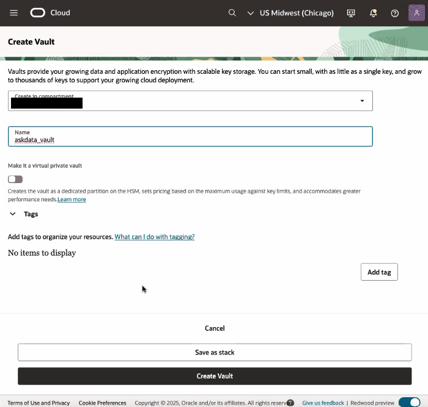
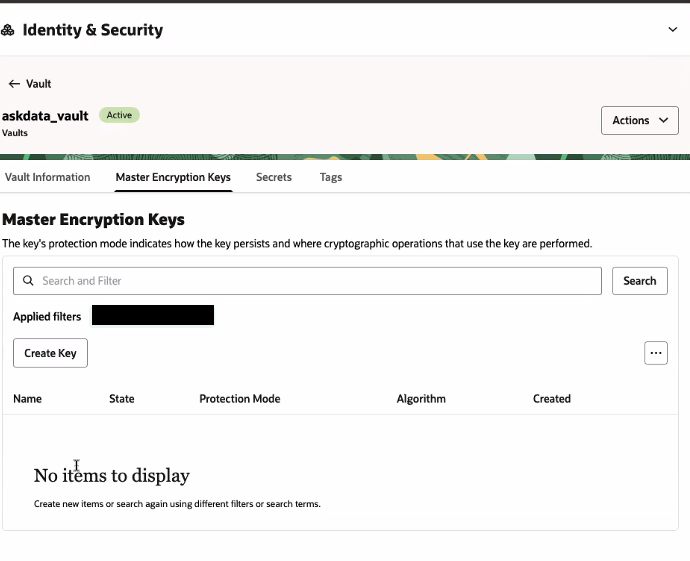
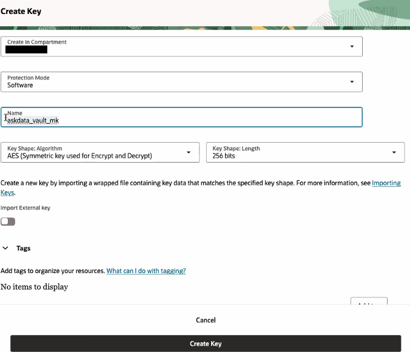
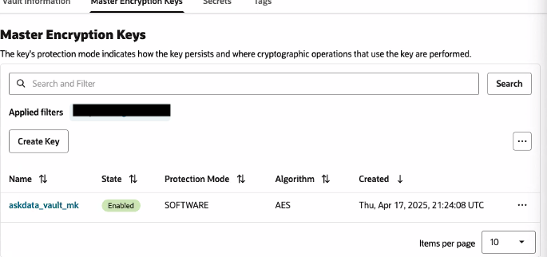
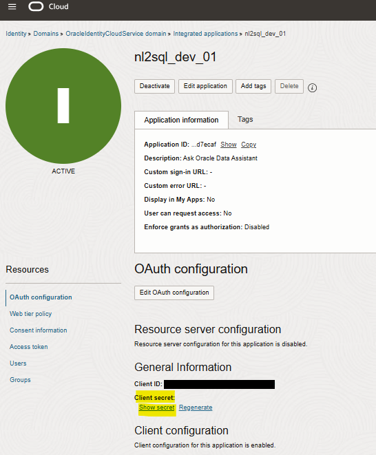
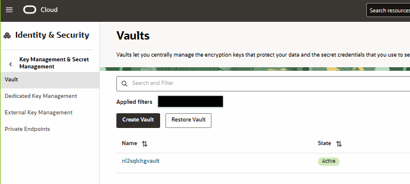
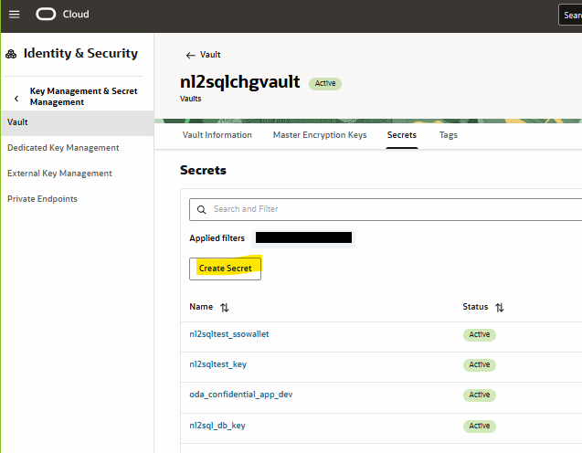
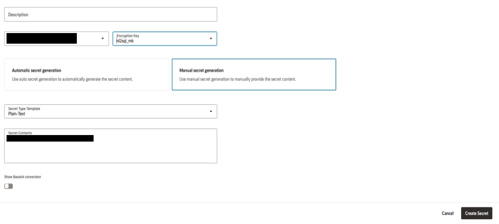

# Vault - Secret

## Creating the Vault's Structure

1.  This page assumes that the vault already exists. If it doesn't, then you can follow this link,
    <https://docs.oracle.com/en-us/iaas/Content/KeyManagement/Tasks/managingvaults_topic-To_create_a_new_vault.htm#createnewvault>
    to create it.

 

2.  We assume that the master key already exists. If not, follow this link,
    <https://docs.oracle.com/en-us/iaas/Content/KeyManagement/Tasks/managingkeys_topic-To_create_a_new_key.htm>

 

 

 

## Store an IDCS Client Secret in the Vault

1.  Sign in to your Oracle Cloud account as an administrator.
2.  In Oracle Cloud Infrastructure Console, navigate to **Identity &
    Security**, and click **Domains**.
3.  Click the name of the identity domain, and click **Integrated
    applications**.
4.  Search, view the details of the application (for example,
    nl2sql_dev_01) and fetch client secret value.

 

5.  To store client secret in vault’s secret, navigate to vault page
    (for example, nl2sqlchgvault).

 

6.  Navigate to **Secrets** tab, click ‘Create Secret’ button

 

7.  Enter
    1.  Compartment: for example, genai-demos
    2.  Name: for example, oda_confidential_app_dev
    3.  Description
    4.  Encryption Key Compartment: for example, genai-demos
    5.  Encryption Key: pick an existing master key, for example, nl2sql_mk
    6.  Manual secret generation
    7.  Secret Type Template: Plain-Text
    8.  Secret Contents: \<enter the IDCS app client secret\>
    9.  Secret rotation: \<keep default\>

 

With this, you will have the IDCS client Secret store (and accessible) in the Vault.